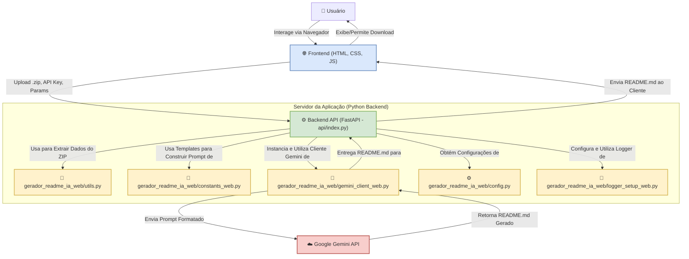

# Readme Generation - Geração Inteligente de READMEs com IA

**Slogan Filosófico:** *Automatizando a Documentação de Projetos com Inteligência Artificial para Potencializar a Colaboração e o Entendimento.*

## Abstract (Resumo Técnico)

O projeto "Readme Generation" é uma aplicação web inovadora projetada para simplificar e aprimorar drasticamente o processo de criação de arquivos README.md para projetos de software. No contexto atual de desenvolvimento ágil e colaborativo, uma documentação clara, concisa e abrangente é crucial, porém frequentemente negligenciada devido ao tempo e esforço exigidos. Este projeto aborda essa lacuna ao empregar a capacidade de modelos de linguagem de grande escala (LLMs), especificamente a API Gemini do Google, para analisar a estrutura e o conteúdo de um projeto de software (fornecido como um arquivo .zip) e gerar automaticamente um README.md.

A solução consiste em uma interface frontend intuitiva (HTML, CSS, JavaScript) onde o usuário pode fazer upload do seu projeto, fornecer sua chave de API do Gemini, selecionar o modelo Gemini desejado (com o `gemini-1.5-flash-latest` como padrão recomendado), o nível de detalhamento do README (Simples, Moderado, Completo), e informações contextuais adicionais como links para o repositório, projeto em produção e perfil do LinkedIn. O backend, construído com FastAPI (Python), processa esses inputs, extrai dados relevantes do projeto (estrutura de diretórios e conteúdo de arquivos selecionados), constrói um prompt otimizado e interage com a API Gemini para gerar o conteúdo do README. O resultado é um arquivo Markdown bem estruturado, que pode ser customizado e utilizado imediatamente. A principal contribuição deste projeto reside na automação inteligente da documentação, visando economizar tempo dos desenvolvedores, padronizar a qualidade dos READMEs e facilitar a integração e compreensão de novos projetos.

## ✨ Badges Abrangentes


## 📜 Sumário (Table of Contents)

*   [Título do Projeto e Slogan Filosófico](#readme-generation---geração-inteligente-de-readmes-com-ia)
*   [Abstract (Resumo Técnico)](#abstract-resumo-técnico)
*   [✨ Badges Abrangentes](#-badges-abrangentes)
*   [📜 Sumário (Table of Contents)](#-sumário-table-of-contents)
*   [📖 Introdução e Motivação](#-introdução-e-motivação)
*   [🔗 Link Principal / Acesso ao Projeto](#-link-principal--acesso-ao-projeto)
*   [🏗️ Arquitetura do Sistema](#️-arquitetura-do-sistema)
*   [💡 Decisões de Design Chave](#-decisões-de-design-chave)
*   [✨ Funcionalidades Detalhadas (com Casos de Uso)](#-funcionalidades-detalhadas-com-casos-de-uso)
*   [🛠️ Tech Stack Detalhado](#️-tech-stack-detalhado)
*   [📂 Estrutura Detalhada do Código-Fonte](#-estrutura-detalhada-do-código-fonte)
*   [📋 Pré-requisitos Avançados](#-pré-requisitos-avançados)
*   [🚀 Guia de Instalação e Configuração Avançada](#-guia-de-instalação-e-configuração-avançada)
*   [⚙️ Uso Avançado e Exemplos](#️-uso-avançado-e-exemplos)
*   [🔧 API Reference](#-api-reference)
*   [🧪 Estratégia de Testes e Qualidade de Código](#-estratégia-de-testes-e-qualidade-de-código)
*   [🚢 Deployment Detalhado e Escalabilidade](#-deployment-detalhado-e-escalabilidade)
*   [🤝 Contribuição (Nível Avançado)](#-contribuição-nível-avançado)
*   [📜 Licença e Aspectos Legais](#-licença-e-aspectos-legais)
*   [📚 Publicações, Artigos e Citações](#-publicações-artigos-e-citações)
*   [👥 Equipe Principal e Colaboradores Chave](#-equipe-principal-e-colaboradores-chave)
*   [🗺️ Roadmap Detalhado e Visão de Longo Prazo](#️-roadmap-detalhado-e-visão-de-longo-prazo)
*   [❓ FAQ (Perguntas Frequentes)](#-faq-perguntas-frequentes)
*   [📞 Contato e Suporte](#-contato-e-suporte)

## 📖 Introdução e Motivação

A documentação de software, em particular o arquivo `README.md`, serve como o cartão de visitas de qualquer projeto. É frequentemente o primeiro ponto de contato para desenvolvedores, usuários e potenciais contribuidores. Um README bem elaborado pode significativamente reduzir a barreira de entrada, facilitar a compreensão do propósito do projeto, sua configuração, uso e como contribuir. No entanto, a criação e manutenção de documentação de alta qualidade é uma tarefa que consome tempo e, em muitos ciclos de desenvolvimento rápidos, acaba sendo postergada ou realizada de forma superficial. Esta deficiência pode levar a dificuldades na adoção do software, na integração de novos membros na equipe e na colaboração da comunidade.

Soluções existentes para a geração de documentação muitas vezes focam em aspectos específicos, como a documentação de APIs a partir de código-fonte (e.g., Swagger, Javadoc) ou são ferramentas genéricas de edição de texto. Poucas abordam a geração holística e inteligente do conteúdo narrativo e estrutural de um README com base na análise do próprio código e estrutura do projeto.

O projeto "Readme Generation" surge como uma resposta inovadora a este desafio. A motivação central é alavancar os recentes avanços em Inteligência Artificial, especificamente modelos de linguagem de grande escala (LLMs) como o Gemini do Google, para automatizar a criação de READMEs. A proposta de valor única reside na capacidade da IA de "compreender" o contexto de um projeto através da análise de sua estrutura de diretórios e do conteúdo de arquivos selecionados (extraídos de um arquivo .zip fornecido pelo usuário). Com base nessa análise, e em parâmetros fornecidos pelo usuário (como nível de detalhe desejado e links contextuais), a ferramenta gera um README.md inicial que é significativamente mais completo e relevante do que um template vazio ou um esforço manual apressado.

Os objetivos de longo prazo incluem não apenas a economia de tempo para os desenvolvedores, mas também a elevação do padrão de documentação em projetos de software, promovendo maior clareza, colaboração e sustentabilidade no ecossistema de desenvolvimento. O impacto desejado é transformar a documentação de uma tarefa árdua e frequentemente negligenciada em um processo ágil, eficiente e integrado ao ciclo de vida do desenvolvimento de software.

## 🔗 Link Principal / Acesso ao Projeto

🚀 **Acesse a Aplicação Web e Demonstração Online:**

*   **[Readme Generation App](https://readme-generate-2.onrender.com/)**

Através deste link, você pode interagir diretamente com a aplicação, fazer upload do arquivo .zip do seu projeto, configurar os parâmetros desejados e gerar um README.md utilizando a inteligência artificial do Gemini.

## 🏗️ Arquitetura do Sistema

O sistema "Readme Generation" é composto por três componentes principais que interagem para fornecer a funcionalidade de geração de READMEs: o Frontend, o Backend API e o Módulo Core de Geração, que por sua vez interage com a API externa do Google Gemini.

1.  **Frontend (Cliente Web):**
    *   **Tecnologias:** HTML5, CSS3 (com auxílio de classes utilitárias Tailwind CSS via CDN e estilos customizados em `style.css`), JavaScript (ES6+ modularizado).
    *   **Responsabilidades:**
        *   Apresentar a interface do usuário para coleta de dados: upload do arquivo .zip do projeto, chave API Gemini, seleção de modelo, nível de detalhe, links contextuais e badges.
        *   Realizar validações de entrada no lado do cliente.
        *   Comunicar-se com o Backend API para solicitar a listagem de modelos Gemini e a geração do README.
        *   Exibir o README.md gerado e fornecer opções para cópia ou download.
        *   Gerenciar o tema (claro/escuro) e o estado da aplicação (ex: salvar preferências no `localStorage`).

2.  **Backend API (Servidor):**
    *   **Tecnologias:** Python 3.9+, FastAPI, Uvicorn/Gunicorn.
    *   **Responsabilidades:**
        *   Expor endpoints RESTful para o frontend (`/api/list-models`, `/api/generate-readme`).
        *   Receber e validar os dados da requisição (arquivo .zip, parâmetros de geração).
        *   Implementar mecanismos de segurança como rate limiting para proteger a API.
        *   Orquestrar o processo de geração do README, delegando tarefas ao Módulo Core.
        *   Gerenciar a comunicação com a API do Google Gemini através do cliente específico.
        *   Retornar o README.md gerado (ou mensagens de erro) para o frontend.

3.  **Módulo Core de Geração (Lógica de Negócio Python):**
    *   **Tecnologias:** Python 3.9+, `google-generativeai` SDK.
    *   **Componentes Internos:**
        *   `utils.py`: Funções para processar o arquivo .zip, extrair estrutura de diretórios e conteúdo de arquivos relevantes, aplicando filtros e limites.
        *   `constants_web.py`: Contém os templates de prompts para a IA, adaptados para diferentes níveis de detalhe e para incluir os links fornecidos pelo usuário.
        *   `gemini_client_web.py`: Um cliente encapsulado para interagir com a API do Google Gemini, configurando o modelo, enviando prompts e tratando respostas.
        *   `config.py`: Gerencia configurações da aplicação, como o modelo Gemini padrão.
        *   `logger_setup_web.py`: Configura o sistema de logging para monitoramento e depuração.
    *   **Responsabilidades:**
        *   Construir o prompt final para a IA com base nos dados extraídos do projeto, no nível de detalhe selecionado e nos links contextuais.
        *   Invocar o cliente Gemini para enviar o prompt e receber a resposta.
        *   Realizar qualquer pós-processamento necessário no texto do README retornado pela IA (embora o objetivo seja que a IA retorne o Markdown final).

4.  **API Externa (Google Gemini):**
    *   **Tecnologia:** API do Google Generative AI.
    *   **Responsabilidade:** Receber o prompt construído pelo Módulo Core e gerar o conteúdo textual do README.md com base em sua capacidade de processamento de linguagem natural.

**Diagrama de Arquitetura:**



**Fluxo de Dados Principal:**

1.  O usuário acessa o `index.html` no navegador.
2.  O usuário preenche o formulário (upload do .zip, API Key, modelo, nível de detalhe, links, badges).
3.  O JavaScript do frontend valida os dados e envia uma requisição POST para o endpoint `/api/generate-readme` do Backend API, incluindo a API Key do usuário no cabeçalho `X-API-Key`.
4.  O Backend API recebe a requisição, valida os parâmetros e o arquivo .zip.
5.  O `utils.py` no Módulo Core é chamado para extrair a estrutura e o conteúdo relevante do .zip.
6.  O `constants_web.py` fornece o template de prompt apropriado, que é preenchido com os dados extraídos e os links fornecidos pelo usuário.
7.  O `gemini_client_web.py` é instanciado com a API Key do usuário e o modelo selecionado, e envia o prompt completo para a API do Google Gemini.
8.  A API Gemini processa o prompt e retorna o conteúdo do README.md gerado.
9.  O Backend API envia a resposta (o README.md) de volta para o frontend.
10. O frontend exibe o README.md na interface, permitindo que o usuário o copie ou faça o download.

## 💡 Decisões de Design Chave

Diversas decisões de design foram tomadas para moldar a funcionalidade, usabilidade e manutenibilidade do "Readme Generation":

1.  **Backend com FastAPI (Python):**
    *   **Justificativa:** FastAPI foi escolhido por sua alta performance (comparável a Node.js e Go), sintaxe moderna de Python com tipagem (Type Hints), facilidade de desenvolvimento, geração automática de documentação interativa da API (Swagger UI/ReDoc) e suporte nativo a programação assíncrona. Isso é ideal para operações I/O-bound como chamadas para APIs externas (Gemini).
    *   **Alternativas Consideradas:** Flask (mais simples, mas menos funcionalidades out-of-the-box para APIs complexas), Django (mais robusto, porém overkill para este escopo de API).

2.  **Frontend com HTML, CSS Vanilla e JavaScript Modular:**
    *   **Justificativa:** Para a complexidade atual da interface, uma abordagem com HTML semântico, CSS customizado (inspirado na paleta do Discord para um visual moderno e com variáveis CSS para fácil tematização) e JavaScript modular (dividido em arquivos como `apiService.js`, `formHandler.js`, `uiUtils.js`, etc.) oferece simplicidade, controle granular e bom desempenho sem a necessidade de um framework pesado. O uso de classes utilitárias do Tailwind CSS via CDN (`index.html`) agiliza a estilização de componentes específicos.
    *   **Alternativas Consideradas:** Frameworks como React, Vue ou Angular seriam excessivos para a interface atual, adicionando complexidade de build e tamanho de bundle desnecessários.

3.  **Utilização da API Gemini do Google:**
    *   **Justificativa:** A API Gemini oferece acesso a modelos de linguagem de grande escala poderosos, capazes de compreender contexto de código e gerar texto coerente e formatado em Markdown. A flexibilidade de seus modelos (como o `gemini-1.5-flash-latest` para um bom equilíbrio entre custo e performance) é uma vantagem.
    *   **Alternativas Consideradas:** OpenAI GPT API (similar em capacidade, mas a escolha pode depender de familiaridade, custos ou funcionalidades específicas no momento da decisão).

4.  **Chave de API do Gemini Gerenciada pelo Usuário:**
    *   **Justificativa:** Em vez de o serviço arcar com os custos da API Gemini para todos os usuários, cada usuário fornece sua própria chave. Isso torna o projeto mais sustentável para o desenvolvedor e dá ao usuário controle sobre seu uso e gastos com a API. A chave é enviada via cabeçalho `X-API-Key` e usada diretamente nas chamadas do backend para a API Gemini, não sendo armazenada permanentemente no servidor da aplicação. O frontend oferece a opção de salvar a chave localmente no navegador (`localStorage`) para conveniência do usuário.
    *   **Trade-off:** Requer que o usuário tenha uma chave Gemini configurada.

5.  **Processamento de Arquivo .zip:**
    *   **Justificativa:** O formato .zip é um padrão universal para agrupar múltiplos arquivos e pastas, facilitando o upload do projeto pelo usuário. O backend extrai a estrutura de diretórios e o conteúdo de arquivos textuais relevantes para fornecer contexto à IA.
    *   **Implementação:** O módulo `utils.py` implementa a lógica para ler o .zip, filtrar arquivos por extensão e nome, ignorar diretórios comuns (ex: `node_modules`, `.git`), e truncar conteúdos longos para otimizar o tamanho do prompt.

6.  **Prompts Estruturados e Níveis de Detalhe:**
    *   **Justificativa:** Em vez de um prompt genérico, `constants_web.py` define templates de prompt específicos para diferentes níveis de detalhe (Simples, Moderado, Completo). Isso permite ao usuário controlar a verbosidade e o escopo do README gerado, e direciona a IA de forma mais eficaz. Os prompts incluem placeholders para os dados do projeto e os links fornecidos pelo usuário.

7.  **Rate Limiting na API Backend:**
    *   **Justificativa:** Para prevenir abuso e garantir a disponibilidade do serviço, a API implementa um mecanismo de rate limiting baseado no IP do cliente. Isso limita o número de requisições que um usuário pode fazer em um determinado período, com bloqueios progressivos em caso de excesso.
    *   **Implementação:** Em `api/index.py`, usando um dicionário em memória para rastrear requisições por IP.

8.  **Deployment em Plataformas PaaS/Serverless:**
    *   **Justificativa:** A aplicação (frontend e backend API) é projetada para ser facilmente implantável em plataformas como Render (onde a demo está hospedada) ou Render (mencionado na configuração de log do backend). Essas plataformas simplificam o deploy, gerenciamento de infraestrutura e escalabilidade.
    *   **Benefícios:** SSL automático, CI/CD facilitado, escalabilidade sob demanda.

## ✨ Funcionalidades Detalhadas (com Casos de Uso)

O "Readme Generation" oferece um conjunto de funcionalidades focadas em facilitar e automatizar a criação de READMEs:

1.  **Upload de Projeto via Arquivo .zip:**
    *   **Descrição:** O usuário pode fazer upload de seu projeto de software compactado em um arquivo .zip. A aplicação analisará a estrutura de diretórios e o conteúdo de arquivos selecionados deste .zip.
    *   **Caso de Uso:** Um desenvolvedor finalizou uma versão inicial de seu projeto e deseja criar um README rapidamente. Ele compacta a pasta do projeto em um .zip e faz o upload na aplicação.

2.  **Configuração da API Gemini:**
    *   **Descrição:** O usuário deve fornecer sua própria chave de API do Google Gemini. Há uma opção para salvar esta chave localmente no navegador (`localStorage`) para uso futuro, evitando a necessidade de inseri-la a cada sessão.
    *   **Caso de Uso:** Ao usar a ferramenta pela primeira vez, o usuário insere sua chave API Gemini. Se marcar a opção "Salvar API Key", nas próximas visitas a chave já estará preenchida.

3.  **Seleção Dinâmica de Modelo Gemini:**
    *   **Descrição:** Após fornecer uma API Key válida, a aplicação consulta a API Gemini (através do backend) e lista os modelos disponíveis compatíveis com geração de conteúdo. O usuário pode selecionar o modelo desejado (ex: `gemini-1.5-flash-latest`, `gemini-1.5-pro-latest`). Uma opção "Usar modelo padrão do sistema" permite que o backend escolha o modelo configurado como padrão (atualmente `gemini-1.5-flash-latest`).
    *   **Caso de Uso:** Um usuário avançado deseja testar um modelo Gemini mais potente para um projeto complexo, selecionando-o na lista. Para a maioria dos casos, o usuário pode deixar o padrão ou escolher o "flash" para rapidez e economia.

4.  **Definição do Nível de Detalhamento do README:**
    *   **Descrição:** O usuário pode escolher entre três níveis de detalhamento para o README gerado:
        *   **Simples:** Foco no essencial para um desenvolvedor experiente entender e rodar o projeto.
        *   **Moderado:** Documentação profissional e informativa, bem estruturada.
        *   **Completo:** README exaustivo, com profundidade analítica, ideal para referência técnica.
    *   **Caso de Uso:** Para um pequeno script utilitário, o desenvolvedor escolhe "Simples". Para um projeto open-source que busca colaboradores, ele opta por "Completo".

5.  **Fornecimento de Links Contextuais Opcionais:**
    *   **Descrição:** O usuário pode fornecer links para o repositório do projeto (GitHub, GitLab, etc.), um link para o projeto em produção ou demonstração, e um link para seu perfil LinkedIn. Esses links são usados pela IA para enriquecer o README com badges, links diretos, informações de contato, etc.
    *   **Caso de Uso:** Ao gerar um README para um projeto no GitHub, o usuário informa o link do repositório. A IA usará esse link para criar badges de licença, issues, e o comando `git clone` correto.

6.  **Seleção de Badges (Shields.io):**
    *   **Descrição:** O usuário pode selecionar quais tipos de badges (ex: Licença, Issues Abertas, Último Commit) deseja incluir no README. A IA tentará gerar os badges correspondentes usando o link do repositório fornecido.
    *   **Caso de Uso:** O desenvolvedor seleciona os badges "Licença", "Linguagem Principal" e "Issues Abertas" para incluir no topo do README.

7.  **Geração Inteligente do README.md:**
    *   **Descrição:** Com base em todas as entradas do usuário e na análise do .zip, a aplicação constrói um prompt detalhado e o envia para o modelo Gemini selecionado. A IA então gera o conteúdo do arquivo README.md.
    *   **Caso de Uso:** Após preencher todos os campos, o usuário clica em "Gerar README". A aplicação processa os dados e, após alguns instantes, exibe o README gerado pela IA.

8.  **Visualização e Download do README:**
    *   **Descrição:** O README.md gerado é exibido em uma área de texto formatada na interface. O usuário pode copiar o conteúdo ou clicar em um botão para fazer o download do arquivo `README.md`.
    *   **Caso de Uso:** O usuário revisa o README gerado, copia o conteúdo para a área de transferência e cola no arquivo `README.md` de seu projeto local, ou faz o download direto.

9.  **Interface Responsiva com Tema Claro/Escuro:**
    *   **Descrição:** A interface da aplicação é responsiva e se adapta a diferentes tamanhos de tela. Possui um seletor de tema que permite ao usuário alternar entre um modo claro e um modo escuro, com preferência salva no `localStorage`.
    *   **Caso de Uso:** O usuário prefere trabalhar com interfaces escuras e ativa o tema escuro na aplicação.

10. **Tooltips de Ajuda Contextual:**
    *   **Descrição:** Vários campos do formulário possuem ícones de ajuda que, ao serem clicados, exibem tooltips com explicações sobre o propósito e o uso do campo específico.
    *   **Caso de Uso:** Um usuário novo não tem certeza sobre o que é o "Nível de Detalhamento" e clica no ícone de ajuda para obter uma explicação.

11. **Validação de Formulário e Feedback ao Usuário:**
    *   **Descrição:** A aplicação realiza validações nos campos do formulário (ex: formato da API Key, validade de URLs) e exibe mensagens de erro ou status para guiar o usuário.
    *   **Caso de Uso:** O usuário digita uma API Key em formato incorreto e recebe uma mensagem de erro indicando o problema antes de tentar gerar o README.

## 🛠️ Tech Stack Detalhado

A tabela abaixo detalha as principais tecnologias utilizadas no desenvolvimento do "Readme Generation":

| Categoria     | Tecnologia             | Versão Específica (ou mínima) | Propósito no Projeto                                                                 | Justificativa da Escolha                                                                                                |
|---------------|------------------------|-------------------------------|--------------------------------------------------------------------------------------|-------------------------------------------------------------------------------------------------------------------------|
| **Backend**   | Python                 | >=3.9                         | Linguagem principal para toda a lógica do servidor e interação com a IA.               | Vasto ecossistema, sintaxe clara, forte suporte para desenvolvimento web e IA (biblioteca `google-generativeai`).         |
|               | FastAPI                | >=0.100.0                     | Framework web assíncrono para construir a API RESTful.                                 | Alta performance, facilidade de uso, tipagem de dados, documentação automática (Swagger/ReDoc).                         |
|               | Uvicorn                | >=0.20.0                      | Servidor ASGI para rodar FastAPI em desenvolvimento e produção.                        | Implementação leve e rápida de ASGI, recomendada para FastAPI.                                                          |
|               | Gunicorn               | >=20.0.0                      | Servidor de aplicação WSGI/ASGI para produção (usado com Uvicorn workers).             | Robusto e amplamente utilizado para deploy de aplicações Python em produção.                                            |
|               | google-generativeai    | >=0.5.0                       | SDK oficial do Google para interagir com a API Gemini.                                 | Simplifica a comunicação com os modelos Gemini, gerenciamento de API Key e tratamento de respostas.                     |
|               | python-multipart       | >=0.0.5                       | Necessário para o FastAPI manipular uploads de arquivos (`UploadFile`).                | Padrão para lidar com dados `multipart/form-data` em FastAPI.                                                           |
|               | python-dotenv          | >=1.0.0                       | Carrega variáveis de ambiente de um arquivo `.env` durante o desenvolvimento local.    | Facilita a configuração de variáveis sensíveis ou específicas do ambiente sem hardcoding.                             |
| **Frontend**  | HTML5                  | N/A                           | Estrutura semântica das páginas web.                                                   | Padrão fundamental da web.                                                                                              |
|               | CSS3                   | N/A                           | Estilização visual da interface do usuário, incluindo temas claro/escuro.              | Padrão para design web, uso de variáveis CSS para tematização eficiente.                                                |
|               | JavaScript (ES6+)      | N/A                           | Lógica do lado do cliente, interatividade, chamadas à API, manipulação do DOM.         | Linguagem padrão para desenvolvimento web frontend, funcionalidades modernas com ES6+.                                   |
|               | Tailwind CSS (utility) | Via CDN                       | Classes utilitárias para estilização rápida de componentes específicos no `index.html`.  | Agiliza o desenvolvimento de UI sem a necessidade de escrever CSS customizado extensivo para tudo.                      |
|               | Ionicons               | ^7.1.0 (via CDN)              | Biblioteca de ícones vetoriais para a interface do usuário.                            | Oferece uma variedade de ícones de alta qualidade e fáceis de integrar.                                                 |
| **API Externa**| Google Gemini API      | N/A                           | Modelo de linguagem de grande escala para a geração do conteúdo do README.             | Capacidade avançada de processamento de linguagem natural e geração de texto contextualizado.                           |
| **Deployment**| Render.com             | N/A                           | Plataforma como Serviço (PaaS) para hospedar a aplicação web (frontend e backend).     | Suporte integrado para aplicações Python (FastAPI), SSL automático, CI/CD, escalabilidade. (Inferido do link do projeto) |
|               | Render (potencial)     | N/A                           | Plataforma para deploy de frontends e funções serverless (mencionada no log da API).   | Facilidade de deploy para funções Python serverless, ideal para APIs.                                                   |

## 📂 Estrutura Detalhada do Código-Fonte

O projeto "Readme Generation" é organizado da seguinte forma, visando modularidade e clareza:

```
readme-generate-2/
├── api/                            # Contém a lógica da API backend (FastAPI)
│   └── index.py                    # Ponto de entrada principal da API, define endpoints, rate limiting.
├── gerador_readme_ia_web/          # Módulo Python principal com a lógica de negócio da aplicação web
│   ├── __init__.py                 # Inicializador do pacote Python.
│   ├── config.py                   # Gerencia configurações da aplicação (ex: modelo Gemini padrão).
│   ├── constants_web.py            # Contém os templates de prompts para a IA e instruções de links.
│   ├── gemini_client_web.py        # Cliente encapsulado para interagir com a API Google Gemini.
│   ├── logger_setup_web.py         # Configuração do sistema de logging para a aplicação.
│   └── utils.py                    # Funções utilitárias (ex: extração de dados de arquivos .zip).
├── public/                         # Arquivos estáticos servidos ao cliente (frontend)
│   ├── assets/                     # Recursos visuais estáticos
│   │   └── favicon.png             # Ícone da aplicação.
│   ├── js/                         # Scripts JavaScript modulares para o frontend
│   │   ├── apiService.js           # Funções para realizar chamadas à API backend.
│   │   ├── formHandler.js          # Lógica principal de manipulação do formulário e geração.
│   │   ├── localStorageManager.js  # Gerenciamento de dados salvos no localStorage do navegador.
│   │   ├── script.js               # Ponto de entrada principal do JavaScript, inicializações.
│   │   ├── themeManager.js         # Lógica para alternar e persistir o tema (claro/escuro).
│   │   ├── tooltipManager.js       # Gerenciamento da exibição de tooltips de ajuda.
│   │   ├── uiUtils.js              # Funções utilitárias para interações com a UI (ex: mostrar status).
│   │   └── validationUtils.js      # Funções para validação de campos do formulário.
│   └── style.css                   # Folha de estilos CSS customizada para a aplicação.
├── index.html                      # Arquivo HTML principal da interface do usuário.
├── LICENSE.md                      # Arquivo de licença do projeto (MIT License).
├── README.md                       # Este arquivo de documentação.
└── requirements.txt                # Lista de dependências Python para o backend.
```

**Explicação dos Diretórios e Arquivos Chave:**

*   **`api/index.py`**: Coração do backend. Define todos os endpoints da API (`/list-models`, `/generate-readme`), implementa a lógica de rate limiting e orquestra a chamada aos módulos em `gerador_readme_ia_web` para processar a requisição e interagir com a API Gemini.
*   **`gerador_readme_ia_web/`**: Este pacote Python encapsula a lógica central da aplicação que não está diretamente ligada ao framework FastAPI.
    *   `config.py`: Centraliza configurações, como o nome padrão do modelo Gemini, facilitando alterações.
    *   `constants_web.py`: Fundamental para a qualidade da geração, pois armazena os prompts detalhados que guiam a IA, incluindo placeholders para dados dinâmicos.
    *   `gemini_client_web.py`: Abstrai a complexidade da comunicação com a API Gemini, tratando da configuração do modelo, envio de prompts e recebimento de respostas.
    *   `logger_setup_web.py`: Essencial para depuração e monitoramento, configura um logging consistente para a aplicação.
    *   `utils.py`: Contém a lógica crucial de análise do arquivo .zip, selecionando e lendo arquivos relevantes para fornecer contexto à IA.
*   **`public/`**: Contém todos os ativos do frontend. A separação em subdiretórios (`assets/`, `js/`) e a modularização dos scripts JavaScript (`apiService.js`, `formHandler.js`, etc.) promovem uma melhor organização e manutenibilidade do código cliente.
*   **`index.html`**: A única página HTML da Single Page Application (SPA), onde toda a interação do usuário ocorre.
*   **`requirements.txt`**: Define as bibliotecas Python necessárias para que o backend funcione corretamente, permitindo a fácil recriação do ambiente.
*   **`LICENSE.md`**: Especifica os termos legais sob os quais o software é distribuído.

Essa estrutura visa separar as preocupações (backend, frontend, lógica de IA) e facilitar o desenvolvimento e a manutenção do projeto.

## 📋 Pré-requisitos Avançados

Para instalar, configurar e executar o projeto "Readme Generation" em um ambiente de desenvolvimento local, os seguintes pré-requisitos são necessários:

1.  **Python:**
    *   Versão: 3.9 ou superior.
    *   É recomendado o uso de um ambiente virtual Python (como `venv` ou `conda`) para isolar as dependências do projeto.

2.  **pip:**
    *   O gerenciador de pacotes Python, geralmente instalado junto com o Python. Usado para instalar as dependências listadas em `requirements.txt`.

3.  **Navegador Web Moderno:**
    *   Para interagir com a interface frontend (ex: Chrome, Firefox, Edge, Safari).
    *   Deve ter suporte a JavaScript ES6+ e `localStorage`.

4.  **Chave de API do Google Gemini:**
    *   Uma chave de API válida do Google AI Studio (para a API Gemini) é **essencial**. O usuário precisará fornecer esta chave na interface da aplicação para que a geração de README funcione.
    *   Instruções para obter uma chave podem ser encontradas na [documentação oficial do Google AI Studio](https://ai.google.dev/).

5.  **Git (Opcional, mas Recomendado):**
    *   Para clonar o repositório do projeto a partir do GitHub.

6.  **Conexão com a Internet:**
    *   Necessária para baixar dependências, carregar recursos de CDNs (Tailwind CSS, Ionicons) e para que a aplicação se comunique com a API do Google Gemini.

Não há necessidade de compilação explícita para o código Python ou JavaScript, pois são linguagens interpretadas. As dependências de frontend (Tailwind, Ionicons) são carregadas via CDN, simplificando a configuração local.

## 🚀 Guia de Instalação e Configuração Avançada

Siga os passos abaixo para configurar e executar o projeto "Readme Generation" em seu ambiente de desenvolvimento local.

**1. Clonar o Repositório:**

```bash
git clone https://github.com/ESousa97/readme-generate-2.git
cd readme-generate-2
```

**2. Configurar Ambiente Virtual Python (Recomendado):**

É uma boa prática usar um ambiente virtual para isolar as dependências do projeto.

*   Crie um ambiente virtual (substitua `venv` pelo nome que preferir):
    ```bash
    python -m venv venv
    ```

*   Ative o ambiente virtual:
    *   No macOS e Linux:
        ```bash
        source venv/bin/activate
        ```
    *   No Windows (Git Bash ou PowerShell):
        ```bash
        # Git Bash
        source venv/Scripts/activate
        # PowerShell
        .\venv\Scripts\Activate.ps1
        ```
    Você deverá ver o nome do ambiente virtual no seu prompt (ex: `(venv)`).

**3. Instalar Dependências Python:**

Com o ambiente virtual ativado, instale as bibliotecas Python necessárias:

```bash
pip install -r requirements.txt
```

**4. Configuração de Variáveis de Ambiente (Opcional para Backend):**

O backend (`api/index.py`) utiliza a API Key fornecida pelo usuário através do cabeçalho `X-API-Key` nas requisições do frontend. No entanto, o arquivo `gerador_readme_ia_web/config.py` pode ler a variável de ambiente `GEMINI_MODEL_NAME` para definir um modelo Gemini padrão diferente do codificado (`gemini-1.5-flash-latest`).

Se desejar definir um modelo padrão diferente para o sistema via variável de ambiente:
*   Crie um arquivo `.env` na raiz do projeto (`readme-generate-2/.env`).
*   Adicione a seguinte linha, substituindo pelo modelo desejado:
    ```env
    GEMINI_MODEL_NAME="gemini-1.5-pro-latest" 
    ```
    O `python-dotenv` carregará esta variável quando a aplicação iniciar.

**5. Executar o Servidor da API Backend (FastAPI):**

O backend é uma aplicação FastAPI. Para executá-lo localmente:

```bash
uvicorn api.index:app --reload --port 8000
```

*   `uvicorn`: O servidor ASGI.
*   `api.index:app`: Aponta para o arquivo `index.py` dentro da pasta `api` e para a instância `app` do FastAPI.
*   `--reload`: Habilita o recarregamento automático do servidor quando arquivos Python são alterados (útil para desenvolvimento).
*   `--port 8000`: Define a porta em que o servidor irá escutar. O frontend está configurado para fazer chamadas para `http://127.0.0.1:8000/api` em ambiente de desenvolvimento.

Após iniciar, você deverá ver mensagens no console indicando que o servidor está rodando, por exemplo: `Uvicorn running on http://127.0.0.1:8000 (Press CTRL+C to quit)`.

**6. Acessar a Interface Frontend:**

Abra o arquivo `index.html` diretamente em seu navegador web:

*   Navegue até a pasta do projeto no seu explorador de arquivos e dê um duplo clique em `index.html`.
*   Ou, no terminal, use um comando como `open index.html` (macOS) ou `start index.html` (Windows).

A página da aplicação "Readme Generation" será carregada.

**7. Utilizar a Aplicação:**

*   Na interface carregada no navegador, insira sua **Chave de API do Google Gemini** no campo correspondente.
*   Selecione o modelo Gemini, nível de detalhe, etc.
*   Faça upload do arquivo `.zip` do seu projeto.
*   Clique em "Gerar README".

O frontend fará as chamadas para o backend FastAPI rodando localmente na porta 8000.

**Observações sobre Docker (Não incluído no projeto atual):**
Este projeto não inclui um `Dockerfile` ou configuração `docker-compose.yml`. Se a containerização fosse desejada, seria necessário:
1.  Criar um `Dockerfile` para o backend Python/FastAPI, instalando dependências e expondo a porta 8000.
2.  Decidir como servir o frontend:
    *   Incluí-lo na mesma imagem Docker do backend usando `StaticFiles` do FastAPI.
    *   Criar um container separado para o frontend (ex: com Nginx) e usar `docker-compose` para orquestrar ambos.

## ⚙️ Uso Avançado e Exemplos

Além do fluxo básico de upload e geração, o "Readme Generation" oferece nuances que podem ser exploradas para otimizar os resultados:

1.  **Impacto do Nível de Detalhamento:**
    *   **Simples:** Ideal para projetos pequenos, scripts ou quando se deseja um ponto de partida minimalista. A IA focará em: título, descrição curta, tecnologias, pré-requisitos, instalação e execução.
    *   **Moderado:** Bom para a maioria dos projetos que precisam de uma documentação profissional. A IA incluirá seções como badges, sumário, introdução mais elaborada, funcionalidades principais, estrutura do projeto, e como contribuir.
    *   **Completo:** Recomendado para projetos complexos, bibliotecas, frameworks ou quando se busca uma documentação de referência. A IA tentará preencher todas as seções detalhadas especificadas no prompt, incluindo arquitetura, decisões de design, API reference (se aplicável), estratégia de testes, etc.
    *   **Exemplo:** Se você tem um projeto com uma API bem definida, escolher o nível "Completo" dará à IA a instrução para tentar gerar a seção "API Reference".

2.  **Aproveitando os Links Contextuais:**
    *   **Link do Repositório:** Crucial para a geração de badges precisos (licença, issues, stars, etc.), o comando `git clone` correto, e links para contribuição. Sem ele, a IA usará placeholders.
    *   **Link do Projeto (Demonstração/Produção):** Permite à IA criar uma seção "Acesso ao Projeto" ou "Demonstração Online", tornando o README mais útil para usuários finais.
    *   **Link do LinkedIn:** Usado para enriquecer a seção de "Autores" ou "Contato", especialmente no nível "Completo".
    *   **Exemplo:** Fornecer `https://github.com/seu-usuario/seu-projeto` permitirá que badges como `` sejam gerados corretamente.

3.  **Seleção de Modelo Gemini:**
    *   A lista de modelos é carregada dinamicamente após a inserção da API Key. Modelos como `gemini-1.5-flash-latest` são geralmente mais rápidos e econômicos, ideais para a maioria das tarefas de geração de README. Modelos como `gemini-1.5-pro-latest` podem oferecer resultados mais detalhados ou nuances em projetos muito complexos, mas podem ser mais lentos e ter um custo de API maior.
    *   A opção "Usar modelo padrão do sistema" (que aponta para `gemini-1.5-flash-latest` por padrão na configuração atual) é uma escolha segura.
    *   **Exemplo:** Para um projeto com muitos arquivos de código e uma estrutura complexa, experimentar o `gemini-1.5-pro-latest` (se disponível para sua chave) pode, teoricamente, render uma análise mais profunda, embora o `flash` seja otimizado para tarefas de resumo e geração como esta.

4.  **Qualidade do Arquivo .zip:**
    *   A IA baseia sua análise no conteúdo do .zip. Um .zip bem organizado, contendo os arquivos de código-fonte principais, arquivos de configuração (ex: `requirements.txt`, `package.json`), e talvez um `LICENSE` ou `CONTRIBUTING.md` preexistente, fornecerá mais material para a IA trabalhar.
    *   Arquivos binários, `node_modules`, `.git`, e outros diretórios/arquivos comumente ignorados são filtrados pelo `utils.py` para otimizar o prompt.
    *   **Exemplo:** Incluir um `requirements.txt` claro ajudará a IA a listar corretamente as dependências Python na seção "Tech Stack".

5.  **Iteração e Refinamento:**
    *   O README gerado é um ponto de partida. É altamente recomendável revisá-lo, refinar o texto, adicionar informações que a IA possa ter omitido ou corrigir imprecisões.
    *   Você pode experimentar diferentes níveis de detalhe ou ajustar os links contextuais e gerar novamente se o primeiro resultado não for o ideal.

6.  **Uso dos Badges Selecionados:**
    *   A seleção de badges na interface instrui a IA sobre quais tipos de badges incluir. A IA tentará construí-los usando o link do repositório. Se o link do repositório não for fornecido, ou se um tipo de badge não for aplicável (ex: "Pull Requests" para um repositório sem PRs abertos), ele poderá ser omitido.
    *   **Exemplo:** Se você selecionar "Licença" e "Linguagem Principal" e fornecer um link de repositório GitHub válido, o README gerado provavelmente incluirá os badges correspondentes.

Ao entender essas nuances, os usuários podem maximizar a eficácia da ferramenta "Readme Generation" para produzir documentação de alta qualidade e relevante para seus projetos.

## 🔧 API Reference

O projeto "Readme Generation" expõe uma API backend construída com FastAPI. Abaixo estão os detalhes dos endpoints principais:

**Base URL da API (Desenvolvimento Local):** `http://127.0.0.1:8000/api`
**Base URL da API (Produção - Exemplo Render):** `/api` (relativo ao domínio da aplicação)

---

### 1. Listar Modelos Gemini

*   **Endpoint:** `GET /list-models`
*   **Descrição:** Retorna uma lista de modelos Gemini disponíveis e compatíveis com geração de conteúdo, com base na API Key fornecida.
*   **Autenticação:** Requer a API Key do Gemini no cabeçalho da requisição.
    *   **Header:** `X-API-Key: SUA_CHAVE_API_GEMINI`
*   **Parâmetros:** Nenhum.
*   **Resposta de Sucesso (Código 200 OK):**
    ```json
    {
        "models": [
            {
                "id": "gemini-1.5-flash-latest",
                "name": "Gemini 1.5 Flash",
                "full_name": "models/gemini-1.5-flash-latest"
            },
            {
                "id": "gemini-1.5-pro-latest",
                "name": "Gemini 1.5 Pro",
                "full_name": "models/gemini-1.5-pro-latest"
            }
            // ... outros modelos
        ]
    }
    ```
*   **Respostas de Erro:**
    *   `401 Unauthorized`: API Key não fornecida ou inválida.
        ```json
        { "detail": "API Key não fornecida no cabeçalho X-API-Key para listar modelos." }
        ```
        ou
        ```json
        { "detail": "Erro ao listar modelos: API key not valid. Please pass a valid API key. [...]." }
        ```
    *   `500 Internal Server Error`: Outro erro ao tentar listar os modelos.

---

### 2. Gerar README.md

*   **Endpoint:** `POST /generate-readme`
*   **Descrição:** Processa o arquivo .zip do projeto e os parâmetros fornecidos para gerar um arquivo README.md usando a API Gemini.
*   **Autenticação:** Requer a API Key do Gemini no cabeçalho da requisição.
    *   **Header:** `X-API-Key: SUA_CHAVE_API_GEMINI`
*   **Corpo da Requisição:** `multipart/form-data`
    *   `project_zip` (Obrigatório): `File` - O arquivo .zip contendo o projeto.
    *   `readme_level` (Obrigatório): `String` - O nível de detalhamento desejado para o README. Valores possíveis: `"simple"`, `"moderate"`, `"complete"`.
    *   `gemini_model` (Opcional): `String` - O ID do modelo Gemini a ser usado (ex: `"gemini-1.5-flash-latest"`). Se não fornecido, o backend usará o modelo padrão do sistema (configurado em `gerador_readme_ia_web/config.py`).
    *   `repo_url` (Opcional): `String` - URL do repositório do projeto (ex: GitHub, GitLab).
    *   `project_url` (Opcional): `String` - URL do projeto em demonstração ou produção.
    *   `linkedin_url` (Opcional): `String` - URL do perfil LinkedIn do autor/contato.
    *   `selected_badges[]` (Opcional): `Array[String]` - Lista dos valores dos badges selecionados (ex: `selected_badges=License&selected_badges=Issues`).
*   **Resposta de Sucesso (Código 200 OK):**
    ```json
    {
        "readme_content": "# Título do Projeto Gerado...\n\n## Descrição...",
        "filename": "README_gerado_projetoX.md" 
    }
    ```
    *Nota: O `filename` é uma sugestão, o frontend atualmente usa "README.md" para download.*
*   **Respostas de Erro:**
    *   `400 Bad Request`: Parâmetros inválidos ou ausentes, ou erro na lógica de geração (ex: prompt bloqueado pela IA).
        ```json
        { "detail": "Nível de detalhe do README inválido: [valor_invalido]" }
        ```
        ou
        ```json
        { "detail": "PROMPT BLOQUEADO PELA IA. Razão: [motivo_do_bloqueio]" }
        ```
    *   `401 Unauthorized`: API Key não fornecida ou inválida.
        ```json
        { "detail": "API Key inválida ou não autorizada para geração." }
        ```
    *   `422 Unprocessable Entity`: Erro de validação do FastAPI para os tipos de dados.
    *   `429 Too Many Requests`: Limite de taxa de requisições excedido.
        ```json
        { "detail": "Você excedeu o limite de requisições. Bloqueado por X segundos." }
        ```
    *   `500 Internal Server Error`: Erro inesperado durante o processamento ou comunicação com a API Gemini.
        ```json
        { "detail": "Erro interno ao gerar README: [mensagem_do_erro]" }
        ```

---

A API é protegida por um mecanismo de rate limiting baseado em IP, configurado em `api/index.py`, para prevenir abusos.

## 🧪 Estratégia de Testes e Qualidade de Código

A estratégia de testes e qualidade de código para o "Readme Generation" combina abordagens manuais e automáticas (ou planejadas), com foco na robustez do backend e na usabilidade do frontend.

**1. Frontend (HTML, CSS, JavaScript):**

*   **Testes Manuais de UI/UX:**
    *   Verificação da responsividade da interface em diferentes tamanhos de tela (desktop, tablet, mobile).
    *   Teste de usabilidade dos formulários, botões, seletores de tema e tooltips.
    *   Validação do fluxo completo do usuário: upload, preenchimento de campos, seleção de opções, geração e visualização/download do README.
    *   Teste em múltiplos navegadores modernos (Chrome, Firefox, Edge) para garantir compatibilidade.
*   **Validação de Entrada no Cliente:**
    *   Os scripts JavaScript (`validationUtils.js`, `formHandler.js`) implementam validações para campos como API Key (formato, comprimento), URLs (formato básico), e seleção de modelo. Mensagens de erro são exibidas diretamente na UI.
*   **Qualidade de Código Frontend:**
    *   **Modularização:** O código JavaScript é dividido em módulos por funcionalidade (`apiService.js`, `themeManager.js`, etc.), melhorando a organização e manutenibilidade.
    *   **Linting (Sugerido):** Uso de ferramentas como ESLint e Prettier para padronizar o estilo do código JavaScript e HTML, garantindo consistência.
    *   **Acessibilidade (Ações Futuras):** Revisão para garantir conformidade com as diretrizes WCAG (ex: contraste de cores, navegação por teclado, atributos ARIA).

**2. Backend (Python/FastAPI):**

*   **Tratamento de Erros e Validação:**
    *   FastAPI utiliza Pydantic para validação automática de tipos de dados em requests e responses.
    *   A API implementa tratamento específico para exceções comuns (ex: API Key inválida, erro na API Gemini, prompt bloqueado) e retorna códigos de status HTTP e mensagens de erro apropriadas.
    *   O `api/index.py` inclui um robusto sistema de rate limiting para proteger contra abusos.
*   **Logging:**
    *   O módulo `logger_setup_web.py` configura um sistema de logging detalhado para o backend, registrando informações, avisos e erros. Isso é crucial para depuração e monitoramento em produção (logs são enviados para `stdout`, capturados por plataformas como Render).
*   **Testes Unitários (Planejado/Sugerido):**
    *   **Ferramenta:** `pytest`.
    *   **Escopo:**
        *   Funções em `gerador_readme_ia_web/utils.py` (ex: extração de dados do ZIP, filtragem de arquivos).
        *   Lógica em `gerador_readme_ia_web/gemini_client_web.py` (mockando as chamadas à API Gemini para testar a construção do cliente e o tratamento de respostas).
        *   Funções de configuração em `gerador_readme_ia_web/config.py`.
*   **Testes de Integração (Planejado/Sugerido):**
    *   **Ferramenta:** `pytest` com `HTTPX` ou o `TestClient` do FastAPI.
    *   **Escopo:** Testar os endpoints da API (`/list-models`, `/generate-readme`) de ponta a ponta (sem chamar a API Gemini real, usando mocks), verificando:
        *   Validação de entrada e respostas de erro corretas.
        *   Fluxo de dados correto através dos módulos do backend.
        *   Funcionamento do rate limiting.
*   **Qualidade de Código Backend:**
    *   **Tipagem Estática:** Uso extensivo de type hints em Python, aproveitado pelo FastAPI e útil para análise estática com MyPy.
    *   **Linting e Formatação:** Uso de ferramentas como Flake8 (para linting) e Black (para formatação automática de código) para manter a consistência e aderência ao PEP 8.
    *   **Modularidade:** A lógica de negócio está separada em `gerador_readme_ia_web`, desacoplada da camada de API (FastAPI).

**3. CI/CD (Integração Contínua/Entrega Contínua) - Potencial:**

*   **Plataformas:** GitHub Actions, Render CI/CD, Render CI/CD.
*   **Fluxo Sugerido:**
    1.  Push para o repositório GitHub.
    2.  Gatilho do GitHub Actions para:
        *   Executar linters (Flake8, Black, ESLint, Prettier).
        *   Executar testes unitários e de integração (pytest).
        *   (Opcional) Construir a aplicação (se necessário para algum tipo de deploy).
    3.  Se todos os passos passarem, permitir o merge para a branch principal.
    4.  Deploy automático para a plataforma de hospedagem (Render) ao fazer merge na branch principal ou criar uma tag de release.

Atualmente, a maior parte dos testes é manual, especialmente no frontend. A implementação de testes automatizados para o backend e a formalização de um pipeline de CI/CD são os próximos passos lógicos para aumentar a robustez e a confiabilidade do projeto.

## 🚢 Deployment Detalhado e Escalabilidade

O projeto "Readme Generation" é projetado para ser implantado em plataformas modernas de PaaS (Platform as a Service) ou ambientes serverless, que oferecem facilidade de deploy, gerenciamento e escalabilidade.

**Plataforma de Hospedagem Atual (Demonstração):**

*   **Render.com:** A aplicação de demonstração ([https://readme-generate-2.onrender.com/](https://readme-generate-2.onrender.com/)) está hospedada no Render.
    *   **Tipo de Serviço:** Provavelmente como um "Web Service" no Render, que pode executar aplicações Python/FastAPI.
    *   **Processo de Deploy (Típico no Render):**
        1.  Conectar a conta do Render ao repositório GitHub (`ESousa97/readme-generate-2`).
        2.  Configurar o serviço web:
            *   **Ambiente:** Python.
            *   **Comando de Build:** `pip install -r requirements.txt` (geralmente detectado automaticamente).
            *   **Comando de Start:** `gunicorn -w 4 -k uvicorn.workers.UvicornWorker api.index:app` (um exemplo comum para FastAPI/Gunicorn em produção). O `api.index:app` refere-se ao arquivo `index.py` no diretório `api` e à instância `app` do FastAPI.
            *   **Variáveis de Ambiente:** Nenhuma variável de ambiente crítica é *obrigatoriamente* necessária no servidor para a funcionalidade principal, já que a API Key do Gemini é fornecida pelo cliente. `GEMINI_MODEL_NAME` pode ser configurada se um padrão diferente do codificado for desejado.
        3.  O Render lida com a construção da imagem, deploy e fornecimento de um URL público com SSL.
        4.  O frontend (arquivos em `public/` e `index.html`) pode ser servido pelo mesmo serviço FastAPI usando `StaticFiles` ou como um "Static Site" separado no Render, com regras de reescrita para a API, se necessário. A estrutura atual sugere que o FastAPI serve o `index.html` e os arquivos estáticos.

**Outras Opções de Deployment:**

*   **Render:**
    *   **Backend API:** O diretório `api/` com `index.py` está estruturado de forma compatível com o deploy de Serverless Functions Python na Render. A Render detectaria `api/index.py` e o implantaria como uma função.
    *   **Frontend:** O `index.html` e o diretório `public/` podem ser implantados como um site estático na Render.

*   **AWS (EC2, ECS, Lambda):**
    *   **Lambda + API Gateway:** Para uma arquitetura serverless, o backend FastAPI poderia ser empacotado (ex: com Serverless Framework ou AWS SAM) e implantado como uma função Lambda, exposta via API Gateway.
    *   **ECS/EKS (Containers):** O backend poderia ser containerizado com Docker e implantado em ECS (Elastic Container Service) ou EKS (Elastic Kubernetes Service) para maior controle e escalabilidade.
    *   **EC2:** Implantação tradicional em uma máquina virtual, exigindo mais gerenciamento de infraestrutura.

*   **Google Cloud (Cloud Run, App Engine):**
    *   **Cloud Run:** Ideal para aplicações containerizadas (como o backend FastAPI). Oferece escalabilidade automática baseada em requisições.
    *   **App Engine:** Plataforma PaaS que suporta aplicações Python, abstraindo grande parte da infraestrutura.

**Escalabilidade:**

*   **Horizontal:**
    *   Plataformas como Render (para serverless functions), Cloud Run e App Engine geralmente fornecem escalabilidade horizontal automática, criando mais instâncias da aplicação conforme a demanda aumenta.
    *   Se usando Gunicorn, o número de workers (`-w 4`) pode ser ajustado.
*   **Vertical:**
    *   Em plataformas PaaS/IaaS, pode-se aumentar os recursos (CPU, memória) das instâncias/containers.
*   **Rate Limiting:** O rate limiting implementado na API (`api/index.py`) ajuda a proteger a aplicação contra picos de tráfego súbitos ou abusivos, contribuindo para a estabilidade.
*   **API Gemini:** A escalabilidade da API Gemini é gerenciada pelo Google. É importante estar ciente dos limites de cota da API Gemini associados à chave do usuário.
*   **Stateless Backend:** O backend FastAPI é projetado para ser stateless (não armazena estado da sessão entre requisições, exceto pelo rate limiter em memória que tem um escopo por instância), o que facilita a escalabilidade horizontal.

**Monitoramento e Logging:**

*   **Logging:** A aplicação utiliza o módulo `logging` do Python, configurado em `logger_setup_web.py`. Em plataformas como Render, os logs enviados para `stdout`/`stderr` são automaticamente coletados e podem ser visualizados através do dashboard da plataforma.
*   **Monitoramento de Performance:** As plataformas de hospedagem geralmente oferecem métricas básicas de performance (tempo de resposta, uso de CPU/memória, erros). Ferramentas de APM (Application Performance Monitoring) como Sentry, Datadog ou New Relic poderiam ser integradas para um monitoramento mais aprofundado.

A arquitetura atual é bem adequada para implantação em nuvem e aproveita os benefícios de escalabilidade e gerenciamento oferecidos pelas plataformas modernas.

## 🤝 Contribuição (Nível Avançado)

Agradecemos o seu interesse em contribuir para o "Readme Generation"! Contribuições da comunidade são essenciais para tornar este projeto ainda melhor. Siga estas diretrizes para facilitar o processo:

**1. Configurando o Ambiente de Desenvolvimento:**

*   Siga o [Guia de Instalação e Configuração Avançada](#-guia-de-instalação-e-configuração-avançada) para ter o projeto rodando localmente.

**2. Encontrando Algo para Trabalhar:**

*   Verifique a seção de [Issues](https://github.com/ESousa97/readme-generate-2/issues) no GitHub:
    *   Procure por issues marcadas com `good first issue` se você é novo no projeto.
    *   Procure por `help wanted` para tarefas que precisam de atenção.
    *   Se você tem uma nova ideia ou encontrou um bug não reportado, sinta-se à vontade para criar uma nova issue, descrevendo-a detalhadamente.

**3. Modelo de Branching (GitHub Flow Simplificado):**

1.  **Fork o Repositório:** Crie um fork do repositório `ESousa97/readme-generate-2` para sua conta pessoal no GitHub.
2.  **Clone seu Fork:**
    ```bash
    git clone https://github.com/SEU-USUARIO/readme-generate-2.git
    cd readme-generate-2
    ```
3.  **Adicione o Repositório Original como Upstream:**
    ```bash
    git remote add upstream https://github.com/ESousa97/readme-generate-2.git
    ```
4.  **Crie uma Nova Branch:** A partir da branch `main` (certifique-se de que sua `main` local está atualizada com `upstream/main`), crie uma branch para sua feature ou correção:
    ```bash
    git fetch upstream
    git checkout main
    git rebase upstream/main # Ou git merge upstream/main
    git checkout -b nome-descritivo-da-sua-branch 
    # Ex: feature/adicionar-novo-badge ou fix/corrigir-validacao-url
    ```
5.  **Faça suas Alterações:** Implemente sua feature ou correção de bug.

**4. Convenções de Commit (Sugestão: Conventional Commits):**

Para manter um histórico de commits claro e consistente, sugerimos o uso do padrão [Conventional Commits](https://www.conventionalcommits.org/).
*   Formato: `<tipo>[escopo opcional]: <descrição>`
*   Exemplos:
    *   `feat: adicionar suporte para upload de arquivos .tar.gz`
    *   `fix(api): corrigir tratamento de erro na listagem de modelos`
    *   `docs: atualizar seção de instalação no README`
    *   `style(frontend): refatorar CSS do formulário principal`
    *   `refactor: otimizar lógica de extração de dados do ZIP`
    *   `test: adicionar testes unitários para o gemini_client`

**5. Guia de Estilo de Código:**

*   **Python (Backend):**
    *   Siga o [PEP 8](https://www.python.org/dev/peps/pep-0008/).
    *   Use [Black](https://github.com/psf/black) para formatação automática do código.
    *   Use [Flake8](https://flake8.pycqa.org/en/latest/) para linting.
    *   Utilize type hints sempre que possível.
*   **JavaScript (Frontend):**
    *   Use [Prettier](https://prettier.io/) para formatação automática.
    *   Considere o uso de [ESLint](https://eslint.org/) para linting.
*   **HTML/CSS:**
    *   Mantenha o código limpo, semântico e bem formatado.

**6. Executando Testes (se aplicável):**

*   Se você adicionar ou modificar código que possui testes associados (ou deveria ter), certifique-se de que todos os testes passam.
*   Para o backend Python, se testes `pytest` forem adicionados, execute-os com:
    ```bash
    pytest
    ```

**7. Processo de Pull Request (PR):**

1.  **Commit e Push:** Faça commit das suas alterações para a sua branch no seu fork:
    ```bash
    git add .
    git commit -m "feat: sua mensagem de commit detalhada"
    git push origin nome-descritivo-da-sua-branch
    ```
2.  **Abra um Pull Request:**
    *   Vá para o seu fork no GitHub.
    *   Clique no botão "Compare & pull request" para a branch que você acabou de enviar.
    *   Selecione a branch `main` do repositório `ESousa97/readme-generate-2` como base.
    *   Forneça um título claro e uma descrição detalhada do seu PR:
        *   O que foi alterado e por quê.
        *   Como testar as alterações.
        *   Se o PR resolve alguma issue existente, mencione-a (ex: `Closes #123`).
3.  **Code Review:**
    *   Um dos mantenedores revisará seu PR. Esteja preparado para discutir suas alterações e fazer ajustes se necessário.
    *   Aguarde a aprovação e o merge do seu PR.

**8. Manter seu Fork Atualizado:**

Antes de iniciar uma nova contribuição, atualize sua branch `main` local com as últimas alterações do repositório `upstream`:

```bash
git checkout main
git fetch upstream
git rebase upstream/main # Ou git merge upstream/main
git push origin main
```

Agradecemos antecipadamente por suas contribuições!

## 📜 Licença e Aspectos Legais

Este projeto é distribuído sob os termos da **Licença MIT**.

Você pode encontrar o texto completo da licença no arquivo [LICENSE.md](LICENSE.md) neste repositório.

**Principais Permissões e Condições da Licença MIT:**

*   **Permissão:** A licença concede permissão, gratuitamente, a qualquer pessoa que obtenha uma cópia deste software e dos arquivos de documentação associados (o "Software"), para lidar com o Software sem restrição, incluindo, sem limitação, os direitos de usar, copiar, modificar, mesclar, publicar, distribuir, sublicenciar e/ou vender cópias do Software.
*   **Condição:** O aviso de direitos autorais (`Copyright (c) 2025 Enoque Sousa`) e este aviso de permissão devem ser incluídos em todas as cópias ou partes substanciais do Software.
*   **Sem Garantia:** O SOFTWARE É FORNECIDO "COMO ESTÁ", SEM GARANTIA DE QUALQUER TIPO, EXPRESSA OU IMPLÍCITA.
*   **Sem Responsabilidade:** EM NENHUM CASO OS AUTORES OU DETENTORES DOS DIREITOS AUTORAIS SERÃO RESPONSÁVEIS POR QUALQUER RECLAMAÇÃO, DANOS OU OUTRA RESPONSABILIDADE DECORRENTE DO SOFTWARE.

Ao usar, contribuir ou distribuir este software, você concorda em cumprir os termos desta licença.

## 📚 Publicações, Artigos e Citações

Não aplicável a este projeto neste momento.

## 👥 Equipe Principal e Colaboradores Chave

Este projeto é mantido principalmente por:

*   **Enoque Sousa**
    *   GitHub: [ESousa97](https://github.com/ESousa97)
    *   LinkedIn: [Enoque Sousa](https://www.linkedin.com/in/enoque-sousa-bb89aa168/)

Agradecimentos a todos os futuros contribuidores que ajudarem a melhorar este projeto!

## 🗺️ Roadmap Detalhado e Visão de Longo Prazo

**Visão de Longo Prazo:** Tornar o "Readme Generation" uma ferramenta de referência para desenvolvedores que buscam uma maneira rápida, inteligente e personalizável de criar documentação inicial de alta qualidade para seus projetos, integrando-se possivelmente com plataformas de desenvolvimento e expandindo suas capacidades analíticas.

**Roadmap:**

**🎯 Curto Prazo (Próximos 1-3 meses):**

*   **Melhorias na UI/UX:**
    *   Refinamento visual da interface para maior intuitividade.
    *   Feedback mais detalhado durante o processo de geração (ex: status de análise do ZIP, comunicação com a IA).
    *   Melhoria na apresentação do README gerado (ex: pré-visualização Markdown mais fiel).
*   **Aprimoramento da Extração de Dados do ZIP:**
    *   Suporte a mais tipos de arquivos relevantes para análise (ex: arquivos de configuração de build, Dockerfiles mais complexos).
    *   Melhor heurística para identificar o "coração" do projeto dentro do ZIP.
*   **Opções de Personalização do Prompt:**
    *   Permitir que o usuário adicione instruções customizadas ou seções específicas ao prompt enviado à IA.
*   **Internacionalização (i18n):**
    *   Preparar a estrutura do frontend para suportar múltiplos idiomas, começando com Inglês além do Português do Brasil.
*   **Testes Automatizados:**
    *   Implementar suíte inicial de testes unitários para o backend (módulos em `gerador_readme_ia_web`).

**🎯 Médio Prazo (Próximos 3-9 meses):**

*   **Integração Direta com Repositórios Git:**
    *   Permitir que o usuário forneça um URL de repositório Git (público) em vez de um arquivo .zip. A aplicação clonaria o repositório temporariamente para análise.
    *   (Avançado) Autenticação com GitHub/GitLab para analisar repositórios privados (com permissão do usuário).
*   **Suporte a Outros Modelos de LLM:**
    *   Abstrair o cliente de IA para facilitar a integração com outros provedores de LLM (ex: OpenAI, Claude) como opção para o usuário.
*   **Templates de README Customizáveis:**
    *   Permitir que usuários criem ou selecionem diferentes templates estruturais para seus READMEs, além dos níveis de detalhe.
*   **Análise de Histórico de Commits (se integrado com Git):**
    *   Utilizar o histórico de commits para inferir contribuidores chave, frequência de atividade, etc.
*   **Pipeline de CI/CD Robusto:**
    *   Configurar GitHub Actions para linting, testes automatizados e (potencialmente) deploy.

**🎯 Longo Prazo (9+ meses):**

*   **Plugin para IDEs:**
    *   Desenvolver extensões para IDEs populares (ex: VS Code) que permitam gerar READMEs diretamente do ambiente de desenvolvimento.
*   **Análise Semântica Avançada do Código:**
    *   Ir além da análise textual e estrutural, tentando entender a funcionalidade principal do código para gerar descrições mais precisas.
*   **Recursos Comunitários:**
    *   Permitir que usuários compartilhem templates de prompt ou configurações de README bem-sucedidas.
*   **Versão "Pro" ou Hospedada com Recursos Adicionais:**
    *   Considerar um modelo de serviço onde a aplicação lida com as chaves de API (com cotas de uso) ou oferece funcionalidades premium.

Este roadmap é flexível e será adaptado com base no feedback da comunidade e nas tendências tecnológicas.

## ❓ FAQ (Perguntas Frequentes)

1.  **P: A minha chave de API do Gemini é armazenada no servidor? É seguro usá-la?**
    R: Não, sua chave de API do Gemini **não é armazenada permanentemente no servidor** da aplicação "Readme Generation". Ela é enviada do seu navegador para o nosso backend via HTTPS e usada exclusivamente para fazer a requisição à API do Google Gemini em seu nome durante aquela sessão de geração. Se você marcar a opção "Salvar API Key", ela será salva apenas localmente no `localStorage` do seu navegador, para sua conveniência. O backend não a retém após o processamento da sua solicitação.

2.  **P: Por que preciso fornecer minha própria chave de API do Gemini?**
    R: O uso da API do Google Gemini pode incorrer em custos dependendo do volume de uso e do modelo escolhido. Para tornar este serviço acessível e sustentável, a aplicação requer que os usuários utilizem suas próprias chaves, gerenciando assim seus próprios custos e cotas de uso com o Google.

3.  **P: Quais arquivos dentro do meu .zip são analisados pela IA?**
    R: A aplicação foca em arquivos de texto que são relevantes para entender a estrutura e o propósito do projeto. Isso inclui arquivos de código-fonte comuns (ex: `.py`, `.js`, `.java`, `.html`, `.css`), arquivos de configuração importantes (ex: `requirements.txt`, `package.json`, `pom.xml`), e arquivos de documentação existentes (ex: `README.md`, `LICENSE`). Arquivos binários, diretórios como `node_modules` ou `.git`, e arquivos muito grandes são geralmente ignorados ou truncados para otimizar o prompt enviado à IA. Consulte `gerador_readme_ia_web/utils.py` para detalhes sobre os filtros.

4.  **P: O código do meu projeto (do arquivo .zip) é armazenado nos servidores do "Readme Generation"?**
    R: Não. O arquivo .zip é processado em memória ou armazenado temporariamente no servidor apenas durante o tempo necessário para extrair os dados e gerar o README. Após a conclusão da sua solicitação, o arquivo .zip e seu conteúdo extraído são descartados. Não armazenamos seu código-fonte.

5.  **P: O que acontece se o README gerado não for perfeito?**
    R: O README gerado pela IA é um excelente ponto de partida, mas pode não ser perfeito ou capturar todas as nuances do seu projeto. É altamente recomendável que você revise o conteúdo gerado, faça ajustes, adicione informações específicas ou corrija quaisquer imprecisões. A ferramenta visa economizar tempo significativo, não substituir completamente a revisão humana.

6.  **P: Posso usar a aplicação para projetos em qualquer linguagem de programação?**
    R: Sim. A IA é treinada em uma vasta gama de linguagens de programação e tipos de projeto. Desde que seu .zip contenha arquivos de texto que descrevam o projeto (código, configurações, etc.), a ferramenta deve ser capaz de gerar um README útil.

7.  **P: O que fazer se eu encontrar um bug ou tiver uma sugestão de melhoria?**
    R: Por favor, reporte bugs ou sugira melhorias abrindo uma [Issue no GitHub](https://github.com/ESousa97/readme-generate-2/issues). Sua contribuição é muito bem-vinda!

8.  **P: Existe um limite para o tamanho do arquivo .zip que posso enviar?**
    R: Sim, o servidor de hospedagem (Render, etc.) terá um limite para o tamanho do corpo da requisição HTTP, o que indiretamente limita o tamanho do .zip. Além disso, a aplicação em si possui lógicas em `utils.py` para limitar o número total de arquivos processados e o tamanho do conteúdo extraído de cada arquivo para evitar prompts excessivamente longos para a IA. Tente manter o .zip focado nos arquivos mais relevantes.

## 📞 Contato e Suporte

Se você tiver dúvidas, precisar de suporte, quiser relatar um problema ou discutir o projeto, utilize os seguintes canais:

*   **Reportar Bugs ou Sugerir Funcionalidades:**
    *   Abra uma [**Issue no GitHub**](https://github.com/ESousa97/readme-generate-2/issues). Este é o canal preferencial para questões técnicas e sugestões que podem beneficiar toda a comunidade.

*   **Contato com o Mantenedor Principal:**
    *   Para questões mais diretas ou colaborações, você pode contatar Enoque Sousa através do [LinkedIn](https://www.linkedin.com/in/enoque-sousa-bb89aa168/).

Por favor, forneça o máximo de detalhes possível ao relatar problemas, incluindo passos para reproduzir o erro, mensagens de erro exatas e informações sobre seu ambiente (navegador, sistema operacional), se relevante.
