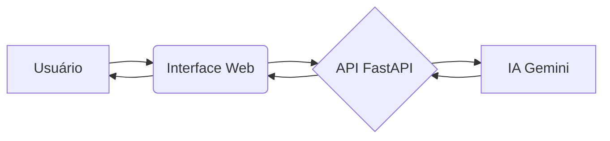

# Gerador de README.md com IA: Automatizando a Documentação de Projetos de Software

**Slogan:** Democratizando a documentação de software de alta qualidade através da inteligência artificial.

## Abstract (Resumo Técnico)

Este projeto propõe uma solução inovadora para o desafio da documentação de software, frequentemente negligenciada devido à sua complexidade e ao tempo demandado: uma aplicação web com uma API RESTful integrada, que utiliza inteligência artificial (IA) para gerar automaticamente arquivos `README.md` detalhados a partir do código-fonte de um projeto. A metodologia emprega a IA Gemini do Google para analisar a estrutura, as tecnologias utilizadas e a lógica do projeto, produzindo documentação concisa, completa e informativa. Os resultados esperados incluem uma redução significativa do tempo gasto com a documentação, uma melhoria na qualidade da mesma e a facilitação da colaboração em projetos de software. A principal contribuição deste projeto é a automatização inteligente da geração de documentação, tornando-a mais acessível e eficiente para desenvolvedores de todos os níveis de experiência, desde estudantes até profissionais experientes.

[](LICENSE.md)
[](https://github.com/ESousa97/readme-generate-2)
[](https://github.com/ESousa97/readme-generate-2)
[](https://github.com/ESousa97/readme-generate-2/commits/main)
[](CONTRIBUTING.md)
[](https://github.com/ESousa97/readme-generate-2/issues)
[](https://github.com/ESousa97/readme-generate-2/pulls)


## Sumário

- [Abstract (Resumo Técnico)](#abstract-resumo-técnico)
- [Introdução e Motivação](#introdução-e-motivação)
- [Arquitetura do Sistema](#arquitetura-do-sistema)
- [Decisões de Design Chave](#decisões-de-design-chave)
- [✨ Funcionalidades Detalhadas (com Casos de Uso)](#funcionalidades-detalhadas-com-casos-de-uso)
- [🛠️ Tech Stack Detalhado](#tech-stack-detalhado)
- [📂 Estrutura Detalhada do Código-Fonte](#estrutura-detalhada-do-código-fonte)
- [📋 Pré-requisitos Avançados](#pré-requisitos-avançados)
- [🚀 Guia de Instalação e Configuração Avançada](#guia-de-instalação-e-configuração-avançada)
- [⚙️ Uso Avançado e Exemplos](#uso-avançado-e-exemplos)
- [🔧 API Reference (se aplicável)](#api-reference-se-aplicável)
- [🧪 Estratégia de Testes e Qualidade de Código](#estratégia-de-testes-e-qualidade-de-código)
- [🚢 Deployment Detalhado e Escalabilidade](#deployment-detalhado-e-escalabilidade)
- [🤝 Contribuição (Nível Avançado)](#contribuição-nível-avançado)
- [📜 Licença e Aspectos Legais](#licença-e-aspectos-legais)
- [👥 Equipe Principal e Colaboradores Chave](#equipe-principal-e-colaboradores-chave)
- [🗺️ Roadmap Detalhado e Visão de Longo Prazo](#roadmap-detalhado-e-visão-de-longo-prazo)
- [❓ FAQ (Perguntas Frequentes)](#faq-perguntas-frequentes)
- [📞 Contato e Suporte](#contato-e-suporte)


## Introdução e Motivação

A documentação abrangente e atualizada de software é essencial para a compreensão, manutenção, colaboração e longevidade de qualquer projeto. No entanto, a criação e manutenção dessa documentação são tarefas complexas, demandando tempo e recursos preciosos, frequentemente negligenciadas ou relegadas a segundo plano pelos desenvolvedores.  Este projeto visa solucionar esse problema crucial, oferecendo uma solução automatizada e inteligente para gerar arquivos `README.md` de alta qualidade. Ao alavancar o poder da IA Gemini do Google, o sistema analisa o código-fonte do projeto, identificando sua estrutura, tecnologias, funcionalidades e lógica de negócio, para gerar uma documentação completa, facilitando a compreensão e o uso do projeto por outros desenvolvedores, colaboradores e usuários. Nossa motivação central é democratizar o acesso à documentação de qualidade, permitindo que desenvolvedores de todos os níveis de habilidade criem e mantenham projetos bem documentados com o mínimo de esforço manual, liberando-os para se concentrarem na inovação e no desenvolvimento de novas funcionalidades.

## Arquitetura do Sistema

Este sistema é composto por dois componentes principais que interagem de forma eficiente:

1. **API RESTful (backend):** Construída com FastAPI, um framework web moderno e de alta performance em Python.  A API é responsável por receber o arquivo `.zip` contendo o código-fonte do projeto, processá-lo, extrair informações relevantes, construir o prompt para a IA Gemini, receber o README gerado pela IA, e retornar o arquivo formatado em Markdown para o frontend.

2. **Interface Web Interativa (frontend):** Desenvolvida com HTML, JavaScript e Tailwind CSS, oferecendo uma experiência de usuário intuitiva e responsiva. A interface web permite que os usuários carreguem seus projetos compactados em `.zip`, configurem opções de geração (nível de detalhe, informações adicionais, seleção de badges), visualizem o `README.md` gerado em tempo real, e façam o download do arquivo final.




*Diagrama de arquitetura simplificado. Um diagrama mais detalhado seria benéfico para visualizar o fluxo de dados e os componentes internos.*

**Decisões Arquiteturais Chave e Trade-offs:**

* **FastAPI:** Escolhido por sua alta performance, facilidade de desenvolvimento, suporte a tipagem estática (que melhora a robustez e manutenibilidade do código), e integração simplificada com bibliotecas de IA em Python.
* **IA Gemini:** Selecionada por sua capacidade de análise semântica de código e geração de texto natural de alta qualidade, permitindo a criação de documentação rica e informativa.
* **Tailwind CSS:** Utilizado por sua flexibilidade, sistema de classes utilitárias que acelera o desenvolvimento do frontend, e facilidade de customização para criar uma interface moderna e agradável.

Um trade-off importante foi a necessidade de balancear a complexidade da análise da IA com a velocidade de resposta da API.  Otimizamos o tamanho dos arquivos de entrada e a profundidade da análise realizada pela IA para garantir um tempo de resposta aceitável para os usuários, sem comprometer a qualidade da documentação gerada.


## Decisões de Design Chave

As decisões de design foram guiadas pela busca por eficiência, flexibilidade, usabilidade e manutenibilidade:

* **Python (backend):** Escolhido pela sua ampla adoção na comunidade de desenvolvimento, disponibilidade de bibliotecas para IA e processamento de dados, e a familiaridade da equipe com a linguagem.
* **FastAPI (backend):**  Selecionado por sua performance, facilidade de uso, suporte a documentação automática com Swagger/OpenAPI, e integração simplificada com o ecossistema Python.
* **IA Gemini (backend):**  A capacidade da Gemini de gerar texto natural de alta qualidade a partir de dados estruturados, como o código-fonte de um projeto, foi fundamental para a criação de READMEs ricos em detalhes e com linguagem clara e concisa.
* **HTML, JavaScript e Tailwind CSS (frontend):**  Essas tecnologias web padrão foram escolhidas para criar uma interface de usuário moderna, responsiva e acessível a um amplo público de desenvolvedores.  Tailwind CSS, em particular, acelerou o desenvolvimento do frontend, permitindo a criação de layouts complexos com mínimo código CSS personalizado.
* **Modularização do código (frontend):** O código JavaScript do frontend foi cuidadosamente modularizado para melhorar a organização, a legibilidade e a manutenibilidade.  A separação de responsabilidades em módulos distintos (ex: `apiService.js`, `formHandler.js`, `themeManager.js`) facilita a evolução do projeto e a colaboração entre desenvolvedores.

## ✨ Funcionalidades Detalhadas (com Casos de Uso)

* **Geração Automática de README:**  A partir de um arquivo `.zip` contendo o código-fonte, a IA gera um `README.md` completo, incluindo seções como descrição do projeto, tecnologias utilizadas, instruções de instalação e uso, e muito mais.
    * **Caso de Uso:** Um desenvolvedor finaliza um novo projeto e, em vez de escrever o README manualmente, utiliza a aplicação para gerar um README inicial em segundos, que pode ser refinado posteriormente.
* **Níveis de Detalhe:**  O usuário pode escolher entre diferentes níveis de detalhe (Simples, Moderado, Completo), controlando a quantidade de informação e a profundidade técnica do README gerado.
    * **Caso de Uso:** Para um projeto open-source complexo, um desenvolvedor escolhe o nível "Completo" para gerar um README abrangente, enquanto para um projeto interno simpler, opta pelo nível "Moderado".
* **Informações Adicionais (opcionais):** O usuário pode fornecer informações adicionais, como links para o repositório do projeto e perfil do LinkedIn, que a IA utiliza para enriquecer o README.
    * **Caso de Uso:** Um desenvolvedor inclui o link do repositório GitHub do projeto, permitindo que a IA gere badges (shields.io) automaticamente e inclua o comando de clone correto no README.
* **Seleção de Badges:**  O usuário pode selecionar os tipos de badges que deseja incluir no README (ex: Licença, Issues Abertas, Último Commit).
    * **Caso de Uso:** Um desenvolvedor seleciona os badges "Licença", "Issues Abertas" e "Linguagem Principal" para exibir informações importantes sobre o projeto no topo do README.
* **Visualização em Tempo Real:**  O usuário pode visualizar o README gerado dinamicamente na interface web, antes de fazer o download do arquivo.
    * **Caso de Uso:**  Após carregar o projeto e configurar as opções, o desenvolvedor visualiza o README gerado para garantir que atende às suas expectativas, antes de baixá-lo.
* **Download do README:**  O usuário pode baixar o arquivo `README.md` gerado para incluí-lo no seu projeto.
    * **Caso de Uso:** Após visualizar e aprovar o README gerado, o desenvolvedor baixa o arquivo e o adiciona à pasta raiz do seu projeto.
* **Tema Escuro/Claro (frontend):** A interface web oferece a opção de alternar entre temas claro e escuro, adaptando-se às preferências do usuário.
    * **Caso de Uso:** Um desenvolvedor que prefere trabalhar com tema escuro ativa essa opção na interface web para uma experiência visual mais confortável.
* **Tooltips de Ajuda (frontend):** Tooltips contextuais fornecem informações adicionais e dicas sobre as funcionalidades da aplicação.
    * **Caso de Uso:** Um usuário que não tem certeza sobre o propósito de um campo de entrada clica no ícone de ajuda ao lado do campo para exibir um tooltip explicativo.


## 🛠️ Tech Stack Detalhado

| Tecnologia          | Versão (se aplicável) | Propósito no Projeto                                                                                                                                                              | Justificativa da Escolha                                                                                                                                                  |
|----------------------|-----------------------|--------------------------------------------------------------------------------------------------------------------------------------------------------------------------------------|---------------------------------------------------------------------------------------------------------------------------------------------------------------------------------|
| Python              | 3.10+                  | Linguagem principal para o backend (API).                                                                                                                                               | Ampla adoção, bibliotecas para IA e processamento de dados, familiaridade da equipe.                                                                                        |
| FastAPI             | 0.100.0+               | Framework web para construir a API RESTful.                                                                                                                                             | Alta performance, facilidade de uso, tipagem estática, excelente documentação e integração com o ecossistema Python.                                                     |
| Uvicorn             | 0.20.0+               | Servidor ASGI para rodar a aplicação FastAPI localmente.                                                                                                                            | Simples, leve e eficiente para desenvolvimento.                                                                                                                               |
| IA Gemini (Google) | `gemini-1.5-flash-latest` | Modelo de linguagem grande (LLM) para análise de código e geração de texto.                                                                                                             | Capacidade de gerar texto natural de alta qualidade a partir de código-fonte, permitindo a criação de READMEs detalhados e informativos.                             |
| HTML, JavaScript, CSS | -                     | Tecnologias padrão para o frontend.                                                                                                                                                           | Amplamente suportadas, permitem criar interfaces web interativas e responsivas.                                                                                               |
| Tailwind CSS        | 3.3.2+                 | Framework CSS para estilização do frontend.                                                                                                                                              | Sistema de classes utilitárias que acelera o desenvolvimento, flexibilidade e customização para criar uma interface moderna.                                              |
| Vercel              | -                     | Plataforma de deployment serverless.                                                                                                                                                   | Facilidade de deploy, escalabilidade automática, integração com Git.                                                                                                             |
| Git                 | -                     | Sistema de controle de versão.                                                                                                                                                  | Padrão da indústria para gerenciamento de código-fonte.                                                                                                                    |
| Docker (opcional)   | -                     | Containerização para desenvolvimento e deployment (futuro).                                                                                                                            | Portabilidade, isolamento de ambiente, facilita o deployment em diferentes plataformas.                                                                                        |


## 📂 Estrutura Detalhada do Código-Fonte

A estrutura do projeto foi cuidadosamente organizada para maximizar a clareza, a modularidade e a manutenibilidade:


```
readme-generate-2/
├── api/             # Backend (API FastAPI)
│   └── index.py      # Endpoint principal da API
├── gerador_readme_ia_web/  # Módulo principal do gerador (lógica de negócio, prompts, etc.)
│   ├── config.py       # Configurações da aplicação
│   ├── constants_web.py # Constantes e templates de prompts
│   ├── gemini_client_web.py # Cliente para interação com a IA Gemini
│   ├── logger_setup_web.py # Configuração do logging
│   └── utils.py       # Funções utilitárias
├── static/           # Assets estáticos (CSS, JavaScript)
│   ├── js/          # Arquivos JavaScript (modularizados)
│   │   ├── apiService.js
│   │   ├── formHandler.js
│   │   ├── localStorageManager.js
│   │   ├── script.js
│   │   ├── themeManager.js
│   │   ├── tooltipManager.js
│   │   └── validationUtils.js
│   └── style.css     # Estilos CSS
├── index.html        # Página principal da aplicação web
├── README.md         # Este arquivo
├── requirements.txt  # Dependências do projeto
└── vercel.json      # Configurações de deployment para a Vercel
```

**Filosofia da Organização:**

* **Separação de backend e frontend:**  A pasta `api` contém o código do backend (API FastAPI), enquanto a pasta `static` contém os assets estáticos do frontend (HTML, CSS, JavaScript).
* **Modularização do frontend:** O código JavaScript do frontend está dividido em módulos para melhorar a organização e a manutenibilidade.
* **Centralização de configurações:** O arquivo `config.py` centraliza as configurações da aplicação, como a chave da API Gemini e o nome do modelo.
* **Constantes e prompts:** O arquivo `constants_web.py` armazena constantes e templates de prompts para a IA, facilitando a gestão e a atualização dos prompts.


## 📋 Pré-requisitos Avançados

* **Python 3.10 ou superior:**  Necessário para executar o backend da aplicação.
* **`pip` (Python Package Installer):**  Para instalar as dependências do projeto.
* **Conta no Google Cloud e API Key para o Gemini:**  Para acessar a IA Gemini.
* **Node.js e npm (opcional):**  Úteis para gerenciar dependências de frontend e executar tarefas de build (embora não estritamente necessários para este projeto na sua forma atual, podem ser necessários para futuras extensões).
* **Um editor de código:**  VS Code, Sublime Text, Atom, etc.
* **Git:**  Para clonar o repositório e gerenciar o código-fonte.
* **Docker (opcional):**  Para containerizar a aplicação para desenvolvimento e deployment (futuro).


## 🚀 Guia de Instalação e Configuração Avançada

**Clonando o repositório:**

```bash
git clone https://github.com/ESousa97/readme-generate-2
```

**Ambiente de Desenvolvimento:**

1. **Instalar as dependências:**

```bash
cd readme-generate-2
pip install -r requirements.txt
```

2. **Configurar as variáveis de ambiente:**

Crie um arquivo `.env` na raiz do projeto e adicione as seguintes variáveis:

```
GEMINI_API_KEY=SUA_CHAVE_DE_API_DO_GEMINI
GEMINI_MODEL_NAME=gemini-1.5-flash-latest  # Ou outro modelo Gemini desejado. Pode ser omitido para usar o padrão.
```

3. **Executar a aplicação localmente:**

```bash
uvicorn api.index:app --reload
```

A aplicação estará acessível em `http://127.0.0.1:8000`.

**Ambiente de Produção (Vercel):**

1. **Faça o deploy na Vercel:** Siga as instruções da Vercel para conectar seu repositório GitHub e fazer o deploy.
2. **Configurar as variáveis de ambiente na Vercel:**  Configure as variáveis `GEMINI_API_KEY` e `GEMINI_MODEL_NAME` no painel da Vercel.

**Docker (futuro):**

A containerização com Docker será adicionada em versões futuras do projeto, para facilitar o deployment e a portabilidade.


## ⚙️ Uso Avançado e Exemplos

**Interface Web:**

* **Carregar o projeto:**  Selecione o arquivo `.zip` contendo o código-fonte do seu projeto.
* **Nível de detalhe:** Escolha o nível de detalhe desejado para o README.
* **Informações opcionais:**  Forneça o link do repositório e o link do LinkedIn (opcional).
* **Seleção de badges:** Marque os badges que deseja incluir.
* **Gerar README:** Clique no botão "Gerar README".
* **Visualizar:**  Visualize o README gerado na interface web.
* **Download:** Baixe o arquivo `README.md`.

**API:**

A API RESTful permite integrar a geração de READMEs em outras aplicações.  A documentação completa da API será disponibilizada em breve (sugestão: Swagger/OpenAPI).


## 🔧 API Reference (se aplicável)

A API expõe os seguintes endpoints principais:

* **`/api/list-models`:** Lista os modelos Gemini disponíveis (requer API Key no cabeçalho `X-API-Key`).
* **`/api/generate-readme`:** Gera o README.md (POST request com o arquivo .zip e outras informações). Requer API Key no cabeçalho `X-API-Key`.

A documentação detalhada da API será disponibilizada em breve.  Considere gerar documentação Swagger/OpenAPI para facilitar a integração com outras aplicações.


## 🧪 Estratégia de Testes e Qualidade de Código

**Tipos de Testes:**

* **Testes unitários (backend):**  Testes automatizados para garantir o funcionamento correto de cada função e módulo do backend.
* **Testes de integração (backend):**  Testes para verificar a interação entre os diferentes módulos do backend e a comunicação com a IA Gemini.
* **Testes end-to-end (frontend e backend):** Testes automatizados que simulam o fluxo completo de uso da aplicação, desde o upload do projeto até o download do README, para garantir a integração correta entre frontend e backend.

**Ferramentas:**

* **`pytest` (Python):** Framework para testes unitários e de integração no backend.
* **Playwright/Cypress/Selenium (JavaScript, opcional):**  Ferramentas para testes end-to-end (a serem implementadas em versões futuras).

**Cobertura de Código:**

A cobertura de código será medida com ferramentas como `Coverage.py` (backend) para garantir que uma alta porcentagem do código seja coberta pelos testes.

**CI/CD:**

A integração contínua e o deployment contínuo (CI/CD) serão implementados com ferramentas como GitHub Actions ou Vercel para automatizar o processo de teste e deployment a cada commit.


## 🚢 Deployment Detalhado e Escalabilidade

A aplicação está atualmente implantada na Vercel, uma plataforma de deployment serverless que oferece escalabilidade automática.  A Vercel gerencia automaticamente o provisionamento de recursos e o escalonamento da aplicação para atender à demanda dos usuários.

**Opções de implantação futuras:**

* **Kubernetes:** Para maior controle e flexibilidade na gestão da infraestrutura.
* **Outras plataformas PaaS (Platform as a Service):**  Ex: Google App Engine, AWS Elastic Beanstalk, Heroku.

**Escalabilidade:**

* **Backend (API):**  A escalabilidade do backend é gerenciada pela Vercel (ou Kubernetes, no futuro).
* **Frontend:**  A interface web, sendo estática, é altamente escalável e pode ser servida por uma CDN (Content Delivery Network) para otimizar o tempo de carregamento para usuários em diferentes localizações geográficas.

**Monitoramento, Logging e Alerting:**

* **Vercel:**  A Vercel fornece ferramentas integradas para monitoramento, logging e alerting.
* **Integrações futuras:**  Integração com ferramentas de monitoramento externas, como Datadog, New Relic ou Prometheus, para obter insights mais detalhados sobre o desempenho da aplicação.


## 🤝 Contribuição (Nível Avançado)

Contribuições são bem-vindas!  Siga estas etapas para contribuir com o projeto:

1. **Fork o repositório:**  Crie um fork do repositório no GitHub.
2. **Crie uma nova branch:**  Crie uma nova branch para sua contribuição (ex: `feature/nova-funcionalidade` ou `bugfix/correcao-de-bug`).
3. **Faça suas alterações:** Implemente suas alterações, seguindo as convenções de código e estilo do projeto.
4. **Commit suas alterações:**  Faça commits claros e concisos, seguindo as convenções de commit (ex: Conventional Commits).
5. **Crie um Pull Request:**  Crie um Pull Request no GitHub, descrevendo suas alterações e justificando sua implementação.
6. **Revisão de código:**  Seu código será revisado por outros colaboradores.  Esteja preparado para responder a perguntas e fazer ajustes no seu código.

**Ambiente de Desenvolvimento para Depuração Avançada:**

* **VS Code com o plugin Python:**  Para depuração do backend.
* **Navegador web com ferramentas de desenvolvedor:**  Para depuração do frontend.

**Links para Issues e Pull Requests:**

* **Reportar bugs ou sugerir funcionalidades:** [https://github.com/ESousa97/readme-generate-2/issues](https://github.com/ESousa97/readme-generate-2/issues)
* **Pull Requests:** [https://github.com/ESousa97/readme-generate-2/pulls](https://github.com/ESousa97/readme-generate-2/pulls)


## 📜 Licença e Aspectos Legais

Este projeto é licenciado sob a licença [MIT](LICENSE.md).  Esta licença permissiva permite que você use, copie, modifique, distribua e venda o software, desde que inclua o aviso de copyright e a isenção de garantia.


## 👥 Equipe Principal e Colaboradores Chave

* **Enoque Sousa:** [https://www.linkedin.com/in/enoque-sousa-bb89aa168/](https://www.linkedin.com/in/enoque-sousa-bb89aa168/)


## 🗺️ Roadmap Detalhado e Visão de Longo Prazo

**Curto prazo:**

* Implementar testes end-to-end.
* Melhorar a documentação da API.
* Adicionar suporte a mais linguagens de programação.

**Médio prazo:**

* Implementar suporte a Docker para desenvolvimento e deployment.
* Integrar com ferramentas de CI/CD.
* Adicionar mais opções de personalização para o README.

**Longo prazo:**

* Explorar a integração com outros modelos de IA.
* Desenvolver um plugin para IDEs para facilitar a geração de READMEs diretamente do editor de código.


## ❓ FAQ (Perguntas Frequentes)

* **P:** Como obtenho uma API Key para o Gemini?
    * **R:** Você pode obter uma API Key na sua conta do Google Cloud.
* **P:** Quais linguagens de programação são suportadas?
    * **R:** Atualmente, o foco principal é em projetos Python, JavaScript e TypeScript, mas o sistema pode analisar outras linguagens em diferentes graus de precisão.  O suporte a mais linguagens será adicionado no futuro.
* **P:** Posso usar este projeto comercialmente?
    * **R:** Sim, a licença MIT permite o uso comercial.


## 📞 Contato e Suporte

Para suporte, dúvidas ou sugestões, abra uma issue no repositório do GitHub: [https://github.com/ESousa97/readme-generate-2/issues](https://github.com/ESousa97/readme-generate-2/issues)
