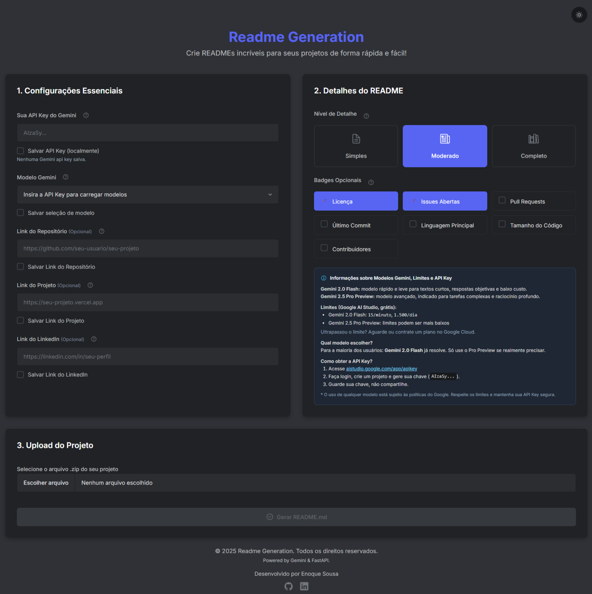
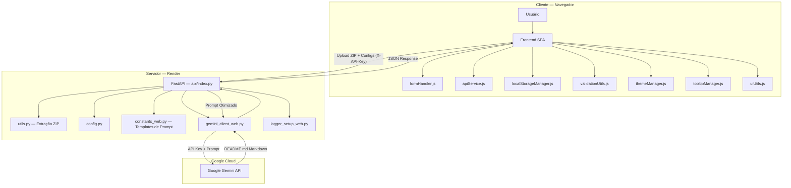

<div align="center">

# Readme Generation

[](https://github.com/ESousa97/readme-generate-2/actions)
[](https://www.codefactor.io/repository/github/esousa97/readme-generate-2)
[](https://opensource.org/licenses/MIT)
[](#)

**Aplicação web para geração automática de READMEs com IA — frontend SPA (HTML5, CSS3, JavaScript ES6+ modular) com tema dark/light inspirado no Discord, backend FastAPI com rate limiting (5 req/min por IP), integração com Google Gemini API (Flash/Pro), 3 níveis de detalhamento (Simples, Moderado, Completo), badges personalizáveis, contextualização automática via URLs (GitHub, LinkedIn, projeto live), persistência de configurações via localStorage e deploy serverless no Render.**

[Acessar Aplicação](https://readme-generate-2.onrender.com) · [Repositório](https://github.com/ESousa97/readme-generate-2)

</div>

---

> **⚠️ Projeto Arquivado**
> Este projeto não recebe mais atualizações ou correções. O código permanece disponível como referência e pode ser utilizado livremente sob a licença MIT. Fique à vontade para fazer fork caso deseje continuar o desenvolvimento.

---

<div align="center">



</div>

---

## Índice

- [Sobre o Projeto](#sobre-o-projeto)
- [Funcionalidades](#funcionalidades)
- [Tecnologias](#tecnologias)
- [Arquitetura](#arquitetura)
- [Estrutura do Projeto](#estrutura-do-projeto)
- [Começando](#começando)
  - [Pré-requisitos](#pré-requisitos)
  - [Instalação](#instalação)
  - [Uso](#uso)
- [Uso Avançado](#uso-avançado)
- [API Reference](#api-reference)
- [Deploy](#deploy)
- [FAQ](#faq)
- [Licença](#licença)
- [Contato](#contato)

---

## Sobre o Projeto

Aplicação web cliente-servidor para geração automática de READMEs profissionais a partir de projetos de software. O usuário faz upload de um arquivo ZIP, configura a chave Gemini e o nível de detalhamento, e a IA gera um README contextualizado baseado na estrutura e conteúdo do projeto.

O repositório prioriza:

- **Backend FastAPI assíncrono** — API RESTful com `POST /generate-readme` e `GET /list-models`, processamento de ZIP com extração inteligente de estrutura e trechos de código, construção de prompts hierárquicos em 3 níveis (Simples, Moderado, Completo) via templates em `constants_web.py`, rate limiting de 5 req/min por IP com bloqueios progressivos, e validação automática com Pydantic
- **Frontend SPA sem framework** — HTML5 + CSS3 com variáveis CSS para dark/light mode + Tailwind CSS (CDN) + JavaScript ES6+ modular (7 módulos: `formHandler`, `apiService`, `localStorageManager`, `validationUtils`, `themeManager`, `tooltipManager`, `uiUtils`), renderização de Markdown via Marked.js, ícones Ionicons
- **Contextualização inteligente via URLs** — Ao fornecer URL do repositório GitHub, a IA infere usuário/projeto para gerar badges dinâmicos e comandos git corretos; URLs de LinkedIn e projeto live enriquecem seções de autor e demonstração
- **Chave API do lado do cliente** — API Key do usuário é transmitida via header `X-API-Key` diretamente ao backend e depois ao Gemini, sem armazenamento no servidor, transferindo custos e limites para o usuário final
- **Persistência via localStorage** — API Key, modelo selecionado, URLs e preferências (incluindo tema) são salvos no navegador entre sessões
- **Deploy serverless no Render** — Gunicorn + Uvicorn workers, auto-scale de 1 a 10 instâncias, health checks, deploy automático via Git, CI/CD simplificado

---

## Funcionalidades

- **3 níveis de detalhamento** — Simples (essencial: instalação e uso básico), Moderado (profissional balanceado com seções principais), Completo (exaustivo com estrutura acadêmica e detalhamento técnico avançado)
- **Seleção dinâmica de modelos** — Após inserir API Key válida, lista automaticamente os modelos Gemini disponíveis (Flash, Pro, etc.) com recomendações contextuais
- **Badges personalizáveis** — Seleção de quais badges incluir: Licença, Issues, Pull Requests, Último Commit, Linguagem Principal, Tamanho do Código, Contribuidores (estilo `for-the-badge`)
- **Contextualização via URLs** — GitHub (badges dinâmicos + comandos git), LinkedIn (perfil profissional na seção de autores), projeto live (links de demonstração)
- **Tema dark/light** — Design inspirado no Discord com paleta de cores moderna, transições suaves, CSS com variáveis para troca dinâmica, preferência salva automaticamente
- **Tooltips educativos** — Explicações detalhadas para cada campo (API Key, modelos, níveis), onboarding para novos usuários
- **Validação em tempo real** — Formato de API Key (`AIzaSy...`, 39 chars), domínios específicos para URLs (GitHub, LinkedIn), ativação/desativação do botão "Gerar" baseada na validade de todos os campos
- **Preview Markdown** — Renderização do README gerado via Marked.js com opções de copiar e baixar como `.md`
- **Rate limiting** — 5 requisições por minuto por IP com bloqueios progressivos e feedback claro de erro 429
- **Persistência local** — Configurações salvas via localStorage (API Key, modelo, URLs, badges, preferências de tema)

---

## Tecnologias


### Dependências Detalhadas

| Categoria | Tecnologia | Versão | Função |
| --- | --- | --- | --- |
| **Backend** | Python | 3.9+ | Linguagem principal do servidor |
| | FastAPI | 0.100+ | Framework API RESTful assíncrono |
| | Uvicorn/Gunicorn | ≥0.20.0 | Servidores ASGI para produção |
| | python-multipart | ≥0.0.5 | Upload de arquivos via FormData |
| | google-generativeai | ≥0.5.0 | SDK oficial Google Gemini |
| | python-dotenv | ≥1.0.0 | Variáveis de ambiente |
| **Frontend** | HTML5 + CSS3 | — | Estrutura e estilização SPA |
| | Tailwind CSS | v3 (CDN) | Classes utilitárias CSS |
| | JavaScript ES6+ | — | Lógica modular do cliente |
| | Marked.js | — | Renderização Markdown → HTML |
| | Ionicons | 7.1.0 | Ícones vetoriais SVG |

---

## Arquitetura



### Componentes e Responsabilidades

| Camada | Módulo | Responsabilidade |
| --- | --- | --- |
| **Frontend** | `formHandler.js` | Validação de formulário, coleta de dados, envio ao backend |
| | `apiService.js` | Comunicação HTTP com backend (upload, list-models) |
| | `localStorageManager.js` | Persistência de API Key, modelo, URLs, preferências |
| | `validationUtils.js` | Validação de formato de API Key, URLs (GitHub/LinkedIn), feedback |
| | `themeManager.js` | Toggle dark/light mode com transições CSS |
| | `tooltipManager.js` | Tooltips educativos com informações contextuais |
| | `uiUtils.js` | Indicadores de progresso, estados de botão, renderização |
| **Backend** | `api/index.py` | Endpoint FastAPI principal, rate limiting, processamento de requests |
| | `utils.py` | Extração e análise de arquivos ZIP (estrutura + trechos de código) |
| | `config.py` | Configurações do sistema (limites, modelos padrão) |
| | `constants_web.py` | Templates de prompt para 3 níveis (Simples, Moderado, Completo) |
| | `gemini_client_web.py` | Cliente Gemini encapsulado (autenticação, envio, erros) |
| | `logger_setup_web.py` | Logging estruturado para debug e monitoramento |

### Fluxo de Dados

1. Usuário configura API Key, seleciona modelo Gemini e nível de detalhamento
2. Frontend valida todos os campos em tempo real (formato, domínios, comprimento)
3. Usuário faz upload do ZIP → frontend envia via `multipart/form-data` com header `X-API-Key`
4. Backend extrai estrutura e conteúdo relevante do ZIP (`utils.py`)
5. `constants_web.py` seleciona template de prompt baseado no nível → `gemini_client_web.py` envia ao Gemini
6. Gemini retorna README em Markdown → backend responde com JSON
7. Frontend renderiza via Marked.js com opções de copiar/baixar

---

## Estrutura do Projeto

```
readme-generate-2/
├── api/
│   └── index.py                        # Endpoint principal FastAPI (serverless)
├── gerador_readme_ia_web/
│   ├── __init__.py
│   ├── config.py                       # Configurações do sistema
│   ├── constants_web.py                # Templates de prompt (3 níveis)
│   ├── gemini_client_web.py            # Cliente Google Gemini API
│   ├── logger_setup_web.py             # Logging estruturado
│   └── utils.py                        # Extração e processamento de ZIP
├── public/
│   ├── assets/
│   │   └── demo.png                    # Screenshot da interface
│   ├── js/
│   │   ├── script.js                   # Entry point JS
│   │   ├── apiService.js               # Comunicação com backend
│   │   ├── formHandler.js              # Validação e envio de formulário
│   │   ├── localStorageManager.js      # Persistência localStorage
│   │   ├── themeManager.js             # Dark/light mode
│   │   ├── tooltipManager.js           # Tooltips educativos
│   │   ├── uiUtils.js                  # Utilitários de UI
│   │   └── validationUtils.js          # Validação de campos e feedback
│   └── style.css                       # CSS principal (variáveis + temas)
├── index.html                          # SPA principal
├── requirements.txt                    # Dependências Python
├── LICENSE.md                          # MIT
└── README.md
```

---

## Começando

### Pré-requisitos

**Para uso da aplicação (online):**
- Navegador moderno (Chrome 80+, Firefox 75+, Safari 13+, Edge 80+)
- API Key do Google Gemini — [Obter no AI Studio](https://aistudio.google.com/app/apikey)

**Para desenvolvimento local:**
- Python 3.9+
- pip ≥21.0
- Git

```bash
python --version   # >= 3.9
pip --version      # >= 21.0
```

### Instalação

```bash
# Clonar o repositório
git clone https://github.com/ESousa97/readme-generate-2.git
cd readme-generate-2

# Criar e ativar ambiente virtual
python -m venv venv

# Linux/macOS
source venv/bin/activate

# Windows
venv\Scripts\activate

# Instalar dependências
pip install -r requirements.txt
```

**Variáveis de ambiente (opcional):** crie `.env` na raiz:

```env
APP_NAME=GeradorREADMEWeb
PYTHON_ENV=development
GEMINI_MODEL_NAME=gemini-2.0-flash-latest
```

### Uso

**Online:** acesse [readme-generate-2.onrender.com](https://readme-generate-2.onrender.com)

**Local:**

```bash
uvicorn api.index:app --reload --host 127.0.0.1 --port 8000
```

Acesse `http://127.0.0.1:8000` no navegador.

---

## Uso Avançado

### Fluxo Completo

1. **Comprimir projeto** em `.zip` (excluir `node_modules`, `.git`, `venv`)
2. **Inserir API Key** Gemini na interface → validação automática de formato
3. **Selecionar modelo** → lista dinâmica dos modelos disponíveis na sua conta
4. **Escolher nível de detalhamento:**

| Nível | Descrição | Uso Ideal |
| --- | --- | --- |
| Simples | Conciso: instalação e uso básico | Projetos pessoais, protótipos |
| Moderado | Profissional balanceado com seções principais | Projetos corporativos, portfólio |
| Completo | Exaustivo com estrutura acadêmica e detalhamento técnico | Open source, TCCs, documentação completa |

5. **Configurar URLs** (opcional): repositório GitHub, projeto live, LinkedIn
6. **Selecionar badges** desejados
7. **Upload do ZIP** → Gerar README
8. **Visualizar, copiar ou baixar** o resultado

### Limites

- ZIP máximo: 5MB
- Até 70 arquivos analisados por projeto
- Rate limit: 5 requisições/minuto por IP

---

## API Reference

**Base URL:** `https://readme-generate-2.onrender.com/api` (produção) · `http://127.0.0.1:8000/api` (local)

**Autenticação:** Header `X-API-Key: SUA_CHAVE_GEMINI`

### GET /list-models

Lista modelos Gemini disponíveis para a API Key fornecida.

**Response (200):**

```json
{
  "models": [
    {
      "id": "gemini-2.0-flash-latest",
      "name": "Gemini 2.0 Flash",
      "full_name": "models/gemini-2.0-flash-latest"
    }
  ]
}
```

### POST /generate-readme

Gera README.md baseado no projeto e configurações.

**Body (multipart/form-data):**

| Campo | Tipo | Obrigatório | Descrição |
| --- | --- | --- | --- |
| `project_zip` | file | Sim | Arquivo ZIP do projeto (máx 5MB) |
| `readme_level` | string | Sim | `simple`, `moderate` ou `complete` |
| `repo_link` | string | Não | URL do repositório GitHub |
| `project_link` | string | Não | URL do projeto em produção |
| `linkedin_link` | string | Não | URL do perfil LinkedIn |
| `requested_badges` | string | Não | Badges separados por vírgula |
| `gemini_model_select` | string | Não | Modelo Gemini específico |

**Response (200):**

```json
{
  "readme_content": "# Título do Projeto\n\nConteúdo gerado...",
  "filename": "projeto_README.md"
}
```

**Códigos de erro:** 400 (dados inválidos/prompt bloqueado), 401 (API Key inválida), 429 (rate limit), 500 (erro interno).

---

## Deploy

Aplicação deployada no **Render** como Web Service:

- **Runtime:** Python 3.9+, Gunicorn + Uvicorn workers
- **Auto-scale:** 1 a 10 instâncias
- **CI/CD:** Deploy automático via push no GitHub
- **Health checks:** Monitoramento ativo
- **Logging:** Centralizado com `logger_setup_web.py`

**Alternativas de deploy:** Vercel (frontend + edge functions), Railway, Google Cloud Run (Docker).

---

## FAQ

<details>
<summary><strong>Minha API Key está segura?</strong></summary>

A chave nunca é armazenada no servidor. É transmitida via header `X-API-Key` do navegador ao backend e depois ao Gemini, sendo descartada após o processamento. No lado do cliente, é salva em localStorage (apenas no seu navegador).
</details>

<details>
<summary><strong>Arquivos ZIP são armazenados?</strong></summary>

Não. Os arquivos são processados em memória temporariamente e descartados após a extração de dados. Nenhum conteúdo do projeto é persistido no servidor.
</details>

<details>
<summary><strong>Qual a diferença entre os 3 níveis de detalhamento?</strong></summary>

**Simples:** README conciso com instalação e uso básico. **Moderado:** Documentação profissional balanceada com seções principais (arquitetura, funcionalidades, contribuição). **Completo:** README exaustivo com estrutura acadêmica, detalhamento técnico avançado, decisões de design e roadmap.
</details>

<details>
<summary><strong>Por que recebo erro "Prompt bloqueado"?</strong></summary>

Os filtros de segurança da API Gemini podem bloquear conteúdo considerado sensível. Revise arquivos do projeto que possam conter termos flagrados e tente novamente, ou use um nível de detalhamento diferente.
</details>

---

## Licença

Este projeto está sob a licença MIT. Veja o arquivo [LICENSE.md](LICENSE.md) para mais detalhes.

```
MIT License - você pode usar, copiar, modificar e distribuir este código.
```

---

## Contato

**José Enoque Costa de Sousa**

[](https://www.linkedin.com/in/enoque-sousa-bb89aa168/)
[](https://github.com/ESousa97)
[](https://enoquesousa.vercel.app)

---

<div align="center">

**[⬆ Voltar ao topo](#readme-generation)**

Feito com ❤️ por [José Enoque](https://github.com/ESousa97)

**Status do Projeto:** Archived — Sem novas atualizações

</div>
