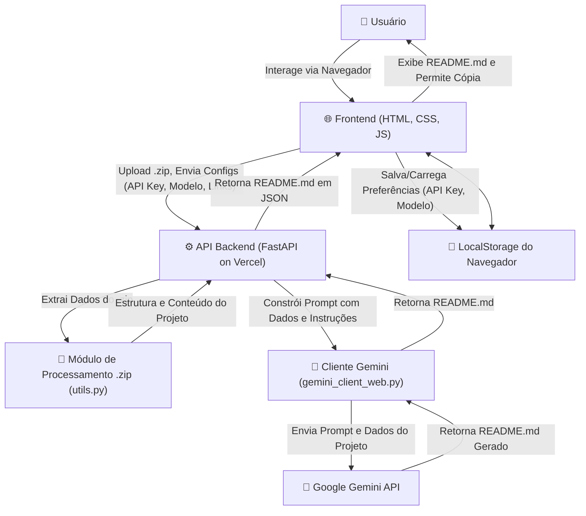

# Readme Generation - Geração Inteligente de READMEs com IA

**Slogan Filosófico:** *Automatizando a Documentação de Projetos com Inteligência Artificial para Potencializar a Colaboração e o Entendimento.*

## Abstract (Resumo Técnico)

O projeto "Readme Generation" é uma aplicação web inovadora projetada para simplificar e aprimorar drasticamente o processo de criação de arquivos README.md para projetos de software. No contexto atual de desenvolvimento ágil e colaborativo, uma documentação clara, concisa e abrangente é crucial, porém frequentemente negligenciada devido ao tempo e esforço exigidos. Este projeto aborda essa lacuna ao empregar a capacidade de modelos de linguagem de grande escala (LLMs), especificamente a API Gemini do Google, para analisar a estrutura e o conteúdo de um projeto de software (fornecido como um arquivo .zip) e gerar automaticamente um README.md.

A solução proposta consiste em uma interface frontend intuitiva (HTML, CSS, JavaScript) onde o usuário pode fazer upload do seu projeto, fornecer sua chave de API do Gemini, selecionar o modelo Gemini desejado, o nível de detalhamento do README (Simples, Moderado, Completo), e informações contextuais adicionais como links para o repositório, projeto em produção e perfil do LinkedIn. O backend, construído com FastAPI (Python), processa esses inputs, extrai dados relevantes do projeto, constrói um prompt otimizado e interage com a API Gemini para gerar o conteúdo do README. O resultado é um arquivo Markdown bem estruturado, que pode ser customizado e utilizado imediatamente. A principal contribuição deste projeto reside na automação inteligente da documentação, visando economizar tempo dos desenvolvedores, padronizar a qualidade dos READMEs e facilitar a integração e compreensão de novos projetos.

## ✨ Badges Abrangentes


## 📜 Sumário (Table of Contents)

*   [Título do Projeto e Slogan Filosófico](#readme-generation---geração-inteligente-de-readmes-com-ia)
*   [Abstract (Resumo Técnico)](#abstract-resumo-técnico)
*   [✨ Badges Abrangentes](#-badges-abrangentes)
*   [📜 Sumário (Table of Contents)](#-sumário-table-of-contents)
*   [📖 Introdução e Motivação](#-introdução-e-motivação)
*   [🔗 Link Principal / Acesso ao Projeto](#-link-principal--acesso-ao-projeto)
*   [🏗️ Arquitetura do Sistema](#️-arquitetura-do-sistema)
*   [💡 Decisões de Design Chave](#-decisões-de-design-chave)
*   [🎯 Funcionalidades Detalhadas (com Casos de Uso)](#-funcionalidades-detalhadas-com-casos-de-uso)
*   [🛠️ Tech Stack Detalhado](#️-tech-stack-detalhado)
*   [📂 Estrutura Detalhada do Código-Fonte](#-estrutura-detalhada-do-código-fonte)
*   [📋 Pré-requisitos Avançados](#-pré-requisitos-avançados)
*   [🚀 Guia de Instalação e Configuração Avançada](#-guia-de-instalação-e-configuração-avançada)
*   [⚙️ Uso Avançado e Exemplos](#️-uso-avançado-e-exemplos)
*   [🔧 API Reference](#-api-reference)
*   [🧪 Estratégia de Testes e Qualidade de Código](#-estratégia-de-testes-e-qualidade-de-código)
*   [🚢 Deployment Detalhado e Escalabilidade](#-deployment-detalhado-e-escalabilidade)
*   [🤝 Contribuição (Nível Avançado)](#-contribuição-nível-avançado)
*   [⚖️ Licença e Aspectos Legais](#️-licença-e-aspectos-legais)
*   [📚 Publicações, Artigos e Citações](#-publicações-artigos-e-citações)
*   [👥 Equipe Principal e Colaboradores Chave](#-equipe-principal-e-colaboradores-chave)
*   [🗺️ Roadmap Detalhado e Visão de Longo Prazo](#️-roadmap-detalhado-e-visão-de-longo-prazo)
*   [❓ FAQ (Perguntas Frequentes)](#-faq-perguntas-frequentes)
*   [📞 Contato e Suporte](#-contato-e-suporte)

## 📖 Introdução e Motivação

A documentação de software, em particular o arquivo `README.md`, serve como o cartão de visitas de qualquer projeto. É frequentemente o primeiro ponto de contato para desenvolvedores, usuários e potenciais contribuidores. Um README bem elaborado pode significativamente reduzir a barreira de entrada, facilitar a compreensão do propósito do projeto, sua configuração, uso e como contribuir. No entanto, a criação e manutenção de documentação de alta qualidade é uma tarefa que consome tempo e, em muitos ciclos de desenvolvimento rápidos, acaba sendo postergada ou realizada de forma superficial. Esta deficiência pode levar a dificuldades na adoção do software, na integração de novos membros na equipe e na colaboração da comunidade.

Soluções existentes para a geração de documentação muitas vezes focam em aspectos específicos, como a documentação de APIs a partir de código-fonte (e.g., Swagger, Javadoc) ou são ferramentas genéricas de edição de texto. Poucas abordam a geração holística e inteligente do conteúdo narrativo e estrutural de um README com base na análise do próprio código e estrutura do projeto.

O projeto "Readme Generation" surge como uma resposta inovadora a este desafio. A motivação central é alavancar os recentes avanços em Inteligência Artificial, especificamente modelos de linguagem de grande escala (LLMs) como o Gemini do Google, para automatizar a criação de READMEs. A proposta de valor única reside na capacidade da IA de "compreender" o contexto de um projeto através da análise de sua estrutura de diretórios e do conteúdo de arquivos selecionados. Com base nessa análise, e em parâmetros fornecidos pelo usuário (como nível de detalhe desejado e links contextuais), a ferramenta gera um README.md inicial que é significativamente mais completo e relevante do que um template vazio ou um esforço manual apressado.

Os objetivos de longo prazo incluem não apenas a economia de tempo para os desenvolvedores, mas também a elevação do padrão de documentação em projetos de software, promovendo maior clareza, colaboração e sustentabilidade no ecossistema de desenvolvimento. O impacto desejado é transformar a documentação de uma tarefa árdua em um processo assistido por IA, mais ágil e eficiente.

## 🔗 Link Principal / Acesso ao Projeto

🚀 **Acesse a Aplicação Web:** **[Readme Generation Live Demo](https://readme-generate-iota.vercel.app/)**

O link acima direciona para a demonstração ao vivo da aplicação "Readme Generation". Através desta interface, você pode:
*   Fazer upload do arquivo `.zip` do seu projeto.
*   Configurar sua chave de API do Google Gemini.
*   Selecionar o modelo Gemini e o nível de detalhe desejado para o seu README.
*   Fornecer links contextuais para enriquecer a geração.
*   Gerar, visualizar e copiar o README.md resultante.

## 🏗️ Arquitetura do Sistema

O sistema "Readme Generation" é composto por três macrocomponentes principais: o Frontend (Interface do Usuário), o Backend (API de Geração) e o Serviço de Inteligência Artificial (Google Gemini API). A arquitetura foi projetada para ser modular, escalável e de fácil manutenção.



**Componentes Detalhados:**

1.  **Frontend (Cliente Web):**
    *   **Tecnologias:** HTML5, CSS3 (com Tailwind CSS utilitário e CSS customizado), JavaScript Vanilla (ES6+ Modules).
    *   **Responsabilidades:**
        *   Renderizar a interface do usuário para coleta de inputs (arquivo .zip, API Key, modelo Gemini, nível de detalhe, links opcionais, seleção de badges).
        *   Validar os inputs do usuário.
        *   Gerenciar o estado da UI (ex: feedback de carregamento, mensagens de erro/sucesso).
        *   Comunicar-se com o API Backend via requisições HTTP (Fetch API).
        *   Exibir o README.md gerado e permitir que o usuário o copie.
        *   Gerenciar o armazenamento local (LocalStorage) para persistir a API Key e a seleção de modelo do usuário, se permitido.
        *   Gerenciar a alternância de tema (claro/escuro).

2.  **API Backend (Servidor FastAPI):**
    *   **Tecnologias:** Python 3.9+, FastAPI, Uvicorn (para desenvolvimento local).
    *   **Responsabilidades:**
        *   Expor endpoints RESTful para as funcionalidades da aplicação (ex: `/api/list-models`, `/api/generate-readme`).
        *   Receber o arquivo .zip do projeto e os parâmetros de configuração do frontend.
        *   Utilizar o `Módulo de Processamento .zip` (`utils.py`) para extrair a estrutura de diretórios e o conteúdo de arquivos relevantes do .zip.
        *   Construir um prompt detalhado e contextualizado para a API Gemini, incorporando os dados extraídos do projeto e as instruções/preferências do usuário (nível de detalhe, links, etc., definidos em `constants_web.py`).
        *   Interagir com o `Cliente Gemini` (`gemini_client_web.py`) para enviar o prompt à API Gemini e receber a resposta.
        *   Implementar mecanismos de segurança, como rate limiting por IP, para proteger a API contra abuso.
        *   Formatar a resposta (o README.md gerado) e enviá-la de volta ao frontend em formato JSON.
        *   Servir os arquivos estáticos do frontend (`index.html`, `public/*`) quando acessado pela raiz.

3.  **Cliente Gemini (Módulo Python):**
    *   **Tecnologias:** SDK `google-generativeai` para Python.
    *   **Responsabilidades:**
        *   Encapsular a lógica de interação com a API Google Gemini.
        *   Configurar o cliente da API com a chave fornecida pelo usuário e o modelo selecionado.
        *   Enviar o prompt construído pelo backend para o modelo Gemini.
        *   Receber e processar a resposta da API Gemini, extraindo o texto do README.md gerado.
        *   Gerenciar erros de comunicação com a API Gemini e feedback de bloqueio de prompt.

4.  **Google Gemini API (Serviço Externo):**
    *   **Tecnologia:** Modelo de linguagem de grande escala (LLM) do Google.
    *   **Responsabilidade:** Receber o prompt e os dados do projeto, analisar essas informações e gerar o conteúdo do arquivo README.md em Markdown, conforme as instruções fornecidas.

5.  **Plataforma de Deployment (Vercel):**
    *   **Responsabilidades:**
        *   Hospedar os arquivos estáticos do frontend.
        *   Executar o backend FastAPI como funções serverless.
        *   Gerenciar o roteamento de requisições, SSL, e escalabilidade da aplicação.

**Fluxo de Dados e Controle:**
O usuário interage com o frontend, fornecendo os dados necessários. O frontend envia uma requisição para o backend. O backend processa o .zip, constrói um prompt e utiliza o cliente Gemini para consultar a API Gemini. A API Gemini retorna o README gerado, que é então retransmitido pelo backend ao frontend para exibição ao usuário.

## 💡 Decisões de Design Chave

Diversas decisões técnicas foram tomadas para moldar a arquitetura e funcionalidade do "Readme Generation":

1.  **FastAPI para o Backend:**
    *   **Justificativa:** FastAPI foi escolhido por sua alta performance (assíncrono sobre ASGI), facilidade de uso, sistema de tipagem moderno com Pydantic para validação automática de dados, e geração automática de documentação de API (Swagger UI/OpenAPI). Sendo um projeto focado em Python para a interação com a IA, FastAPI ofereceu uma integração natural e eficiente.
    *   **Trade-offs:** Curva de aprendizado ligeiramente maior para quem vem de frameworks síncronos como Flask/Django, mas os benefícios de performance e desenvolvimento rápido compensam.

2.  **JavaScript Vanilla para o Frontend:**
    *   **Justificativa:** Para a complexidade atual da interface do usuário, que é relativamente simples (formulários, chamadas AJAX, manipulação de DOM), JavaScript puro (com módulos ES6) oferece leveza, controle granular e evita a sobrecarga de frameworks mais pesados (React, Vue, Angular). Isso resulta em um carregamento mais rápido e menos dependências.
    *   **Trade-offs:** Para UIs significativamente mais complexas, a ausência de um framework reativo poderia levar a um código de manipulação de estado mais verboso e difícil de gerenciar.

3.  **Google Gemini API como Motor de IA:**
    *   **Justificativa:** Os modelos Gemini do Google oferecem capacidades avançadas de geração de texto e compreensão de contexto, adequadas para a tarefa de analisar código e gerar documentação. A disponibilidade de um SDK Python facilitou a integração. A flexibilidade na escolha de modelos (ex: Flash para rapidez/custo, Pro para maior capacidade) permite adaptar-se a diferentes necessidades.
    *   **Trade-offs:** Dependência de um serviço de terceiros (Google) e seus custos associados (o usuário fornece sua própria API Key). A qualidade da geração depende da qualidade do prompt e das capacidades do modelo.

4.  **Deployment em Plataforma Serverless (Vercel):**
    *   **Justificativa:** Vercel simplifica o processo de deployment para aplicações web modernas, especialmente aquelas com frontend estático e backend baseado em funções serverless (como FastAPI). Oferece CI/CD integrado com GitHub, escalabilidade automática e SSL gratuito.
    *   **Trade-offs:** Limitações inerentes a ambientes serverless (ex: tempo máximo de execução de função, "cold starts"). Menos controle sobre a infraestrutura subjacente em comparação com VMs ou containers dedicados.

5.  **Upload de Arquivo .ZIP para Contexto do Projeto:**
    *   **Justificativa:** Fornecer o projeto como um arquivo .zip é uma maneira conveniente e universal para o usuário disponibilizar o contexto completo (estrutura de diretórios e conteúdo de arquivos) para a IA, sem requerer integração direta com sistemas de controle de versão (Git) na primeira versão.
    *   **Trade-offs:** Limitações no tamanho do .zip e no número de arquivos processados para evitar sobrecarga. A análise é estática, baseada no snapshot do .zip.

6.  **Rate Limiting no Backend:**
    *   **Justificativa:** Implementado para proteger a API contra abuso e garantir a disponibilidade do serviço. O rate limiting é baseado em IP e utiliza um sistema de bloqueio progressivo.
    *   **Trade-offs:** Pode impactar usuários legítimos com alto volume de requisições, mas é uma medida de segurança essencial.

7.  **Armazenamento Local (LocalStorage) para Preferências:**
    *   **Justificativa:** Melhorar a experiência do usuário ao persistir a API Key do Gemini e a seleção de modelo no navegador do cliente, evitando que precisem ser inseridas repetidamente.
    *   **Trade-offs:** A API Key é armazenada no lado do cliente; embora conveniente, o usuário deve estar ciente das implicações de segurança de armazenar chaves sensíveis no LocalStorage.

## 🎯 Funcionalidades Detalhadas (com Casos de Uso)

1.  **Upload de Projeto (.zip):**
    *   **Descrição:** O usuário pode selecionar e enviar um arquivo `.zip` contendo o código-fonte e outros artefatos do seu projeto.
    *   **Caso de Uso:** Um desenvolvedor deseja gerar um README para seu novo projeto "WebAppX". Ele compacta a pasta raiz do projeto em `WebAppX.zip` e faz o upload através da interface.

2.  **Configuração da API Key do Gemini:**
    *   **Descrição:** O usuário insere sua chave de API pessoal do Google Gemini, necessária para autenticar e autorizar o uso dos modelos de IA.
    *   **Caso de Uso:** Antes de gerar o README, o usuário acessa suas credenciais na Google AI Studio (ou Google Cloud Console) e copia sua API Key para o campo designado na aplicação. A opção "Salvar API Key" permite armazená-la localmente no navegador.

3.  **Seleção de Modelo Gemini:**
    *   **Descrição:** Após fornecer uma API Key válida, a aplicação lista os modelos Gemini disponíveis (ex: `gemini-1.5-flash-latest`, `gemini-1.5-pro-latest`). O usuário pode selecionar o modelo que melhor se adapta às suas necessidades de custo, velocidade e capacidade.
    *   **Caso de Uso:** Para um projeto pequeno e um README simples, o usuário pode optar pelo `gemini-1.5-flash-latest` para uma geração mais rápida e econômica. Para um projeto complexo que exige um README completo, o `gemini-1.5-pro-latest` pode ser mais adequado.

4.  **Seleção do Nível de Detalhe do README:**
    *   **Descrição:** O usuário escolhe entre três níveis de detalhe para o README a ser gerado: "Simples", "Moderado" ou "Completo". Cada nível utiliza um prompt diferente para instruir a IA sobre a profundidade e as seções a serem incluídas.
    *   **Caso de Uso:** Um desenvolvedor experiente que precisa apenas de um README básico para iniciar rapidamente pode escolher "Simples". Para um projeto público que necessita de documentação abrangente, "Completo" seria a escolha.

5.  **Entrada de Links Contextuais Opcionais:**
    *   **Descrição:** Campos opcionais para fornecer o link do repositório do projeto (GitHub, GitLab, etc.), o link do projeto em produção/demonstração e o link do perfil LinkedIn do autor.
    *   **Caso de Uso:** Ao fornecer o link do repositório GitHub, a IA pode inferir o nome do usuário/projeto para gerar badges precisos e links de clone. O link do projeto permite adicionar uma seção de "Acesso ao Projeto". O link do LinkedIn pode ser usado na seção "Autores".

6.  **Seleção de Badges:**
    *   **Descrição:** O usuário pode selecionar quais badges (Shields.io) deseja incluir no README gerado (ex: Licença, Issues, Último Commit).
    *   **Caso de Uso:** Um usuário quer destacar a licença MIT do seu projeto e o número de issues abertas, então seleciona esses badges específicos.

7.  **Geração de README.md em Markdown:**
    *   **Descrição:** Com todas as configurações e o .zip fornecidos, o usuário clica em "Gerar README". A aplicação processa os dados e envia para a API Gemini, que retorna o conteúdo do README em formato Markdown.
    *   **Caso de Uso:** Após preencher todos os campos, o usuário inicia o processo de geração e aguarda o resultado.

8.  **Visualização e Cópia do README Gerado:**
    *   **Descrição:** O README.md gerado é exibido em uma área de texto formatada na interface. Um botão "Copiar" permite ao usuário copiar facilmente todo o conteúdo para a área de transferência.
    *   **Caso de Uso:** O usuário revisa o README gerado, faz pequenos ajustes se necessário (embora a edição direta na UI não seja o foco principal) e copia o conteúdo para colar em um arquivo `README.md` no seu projeto local.

9.  **Persistência de Configurações no LocalStorage:**
    *   **Descrição:** Se o usuário optar, a API Key do Gemini e a seleção de modelo podem ser salvas no LocalStorage do navegador para uso futuro, evitando a necessidade de reinseri-las a cada sessão.
    *   **Caso de Uso:** Um usuário frequente da ferramenta marca as caixas "Salvar API Key" e "Salvar seleção de modelo" para agilizar o processo em visitas subsequentes.

10. **Tema Claro/Escuro:**
    *   **Descrição:** A interface possui um botão para alternar entre um tema visual claro e um escuro, adaptando-se à preferência do usuário e salvando a escolha no LocalStorage.
    *   **Caso de Uso:** Um usuário que prefere interfaces escuras pode alternar o tema para maior conforto visual durante o uso da aplicação.

## 🛠️ Tech Stack Detalhado

A tabela abaixo detalha as tecnologias utilizadas no projeto "Readme Generation":

| Categoria          | Tecnologia             | Versão Específica (se aplicável) | Propósito no Projeto                                                                | Justificativa da Escolha                                                                                                                                                              |
| :----------------- | :--------------------- | :----------------------------- | :---------------------------------------------------------------------------------- | :------------------------------------------------------------------------------------------------------------------------------------------------------------------------------------ |
| **Backend**        | Python                 | 3.10                          | Linguagem principal para a lógica do servidor e interação com a API Gemini.         | Ecossistema robusto para IA/ML, bibliotecas maduras, sintaxe clara.                                                                                                                   |
|                    | FastAPI                | >=0.100.0                      | Framework web para construir a API RESTful.                                         | Alta performance, desenvolvimento rápido, validação de dados com Pydantic, documentação automática.                                                                                  |
|                    | Uvicorn                | >=0.20.0                       | Servidor ASGI para rodar FastAPI localmente durante o desenvolvimento.              | Padrão para aplicações ASGI como FastAPI.                                                                                                                                             |
|                    | `google-generativeai`  | >=0.5.0                        | SDK oficial do Google para interagir com a API Gemini.                              | Abstrai a complexidade da comunicação com a API Gemini, facilitando o envio de prompts e recebimento de respostas.                                                                  |
|                    | `python-dotenv`        | >=1.0.0                        | Carregar variáveis de ambiente de um arquivo `.env` em desenvolvimento local.     | Facilita a configuração de variáveis como `GEMINI_MODEL_NAME` sem hardcoding.                                                                                                         |
|                    | `python-multipart`     | >=0.0.5                        | Suporte para upload de arquivos (formulários `multipart/form-data`) com FastAPI.    | Necessário para receber o arquivo .zip do projeto enviado pelo frontend.                                                                                                              |
| **Frontend**       | HTML5                  | N/A                            | Estrutura semântica da página web.                                                  | Padrão universal para conteúdo web.                                                                                                                                                   |
|                    | CSS3                   | N/A                            | Estilização da interface do usuário.                                                | Padrão universal para design web. Uso de variáveis CSS para theming.                                                                                                                  |
|                    | JavaScript (Vanilla)   | ES6+ Modules                   | Lógica do lado do cliente, manipulação do DOM, chamadas AJAX, interatividade.       | Leveza, controle total, sem necessidade de um framework pesado para a complexidade atual da UI. Módulos ES6 para organização do código.                                                |
|                    | Tailwind CSS           | (via CDN)                      | Framework CSS utilitário para estilização rápida (usado de forma leve).             | Agiliza a criação de layouts e componentes básicos, embora o estilo principal seja customizado em `style.css`.                                                                          |
| **IA**             | Google Gemini API      | (ex: gemini-1.5-flash)         | Modelo de linguagem de grande escala para gerar o conteúdo do README.               | Capacidades avançadas de geração de texto e compreensão de contexto. Flexibilidade de modelos.                                                                                       |
| **DevOps & Deploy**| Git                    | N/A                            | Sistema de controle de versão.                                                      | Padrão da indústria para gerenciamento de código-fonte e colaboração.                                                                                                                 |
|                    | GitHub                 | N/A                            | Plataforma de hospedagem para o repositório Git e colaboração.                      | Integração com Vercel para CI/CD, gerenciamento de issues e PRs.                                                                                                                      |
|                    | Vercel                 | N/A                            | Plataforma para deployment do frontend estático e backend serverless (FastAPI).     | Facilidade de deployment, CI/CD integrado, escalabilidade automática, SSL. Ideal para este tipo de aplicação.                                                                       |

## 📂 Estrutura Detalhada do Código-Fonte

A organização do código-fonte do projeto "Readme Generation" visa a modularidade e clareza, separando as responsabilidades do backend, frontend e lógica de negócios principal.

```
readme-generate-2/
├── api/                        # Contém a lógica do backend da API.
│   └── index.py                # Ponto de entrada da aplicação FastAPI, define os endpoints da API.
├── gerador_readme_ia_web/      # Pacote Python com a lógica central de geração do README.
│   ├── __init__.py             # Inicializador do pacote.
│   ├── config.py               # Configurações da aplicação (ex: nome do modelo Gemini padrão).
│   ├── constants_web.py        # Constantes, incluindo os templates dos prompts para a IA.
│   ├── gemini_client_web.py    # Cliente para interagir com a API Google Gemini.
│   ├── logger_setup_web.py     # Configuração do sistema de logging.
│   └── utils.py                # Funções utilitárias, como a extração de dados do arquivo .zip.
├── public/                     # Contém os ativos estáticos do frontend.
│   ├── js/                     # Arquivos JavaScript modulares.
│   │   ├── apiService.js       # Lógica para chamadas à API backend.
│   │   ├── formHandler.js      # Gerenciamento do formulário principal e lógica de geração.
│   │   ├── localStorageManager.js # Gerenciamento do LocalStorage para preferências.
│   │   ├── script.js           # Ponto de entrada principal do JS, inicializa módulos.
│   │   ├── themeManager.js     # Lógica para alternância de tema (claro/escuro).
│   │   ├── tooltipManager.js   # Gerenciamento dos tooltips de ajuda.
│   │   ├── uiUtils.js          # Funções utilitárias para manipulação da UI (erros, status).
│   │   └── validationUtils.js  # Funções de validação para campos do formulário.
│   └── style.css               # Folha de estilo principal da aplicação.
├── .gitignore                  # Especifica arquivos e pastas ignorados pelo Git.
├── index.html                  # Arquivo HTML principal da interface do usuário.
├── LICENSE.md                  # Arquivo de licença do projeto (MIT License).
├── README.md                   # Este arquivo de documentação.
├── requirements.txt            # Lista de dependências Python para o backend.
└── vercel.json                 # Configuração de deployment para a plataforma Vercel.
```

**Filosofia da Estrutura:**

*   **Separação de Interesses:** O backend (`api/`, `gerador_readme_ia_web/`) está claramente separado do frontend (`public/`, `index.html`).
*   **Modularidade no Backend:** A lógica de negócios (`gerador_readme_ia_web/`) é um pacote Python coeso, com submódulos para configuração, constantes, cliente da IA, logging e utilitários. Isso facilita a manutenção e testes.
*   **Modularidade no Frontend:** O JavaScript é organizado em módulos (`public/js/`), cada um com uma responsabilidade específica (serviço de API, manipulação de formulário, gerenciamento de tema, etc.), promovendo um código mais limpo e reutilizável.
*   **Configuração Explícita:** Dependências (`requirements.txt`) e configurações de deploy (`vercel.json`) são explícitas e versionadas.

## 📋 Pré-requisitos Avançados

Para instalar, configurar e executar o projeto "Readme Generation" localmente, os seguintes pré-requisitos são necessários:

1.  **Python:**
    *   Versão: 3.9 ou superior.
    *   Verifique com: `python --version`
2.  **pip (Python Package Installer):**
    *   Geralmente incluído com as instalações modernas de Python.
    *   Verifique com: `pip --version`
3.  **Git:**
    *   Necessário para clonar o repositório.
    *   Verifique com: `git --version`
4.  **Navegador Web Moderno:**
    *   Exemplos: Google Chrome, Mozilla Firefox, Microsoft Edge, Safari.
    *   Necessário para interagir com a interface do usuário.
5.  **Chave de API do Google Gemini:**
    *   Essencial para a funcionalidade de geração de README.
    *   Pode ser obtida na [Google AI Studio](https://aistudio.google.com/app/apikey) ou através do Google Cloud Console se você tiver um projeto configurado para usar a API Gemini.
6.  **(Opcional) Ambiente Virtual Python:**
    *   Altamente recomendado para isolar as dependências do projeto. Ferramentas como `venv` (embutida no Python) ou `conda` podem ser usadas.

**Variáveis de Ambiente (para desenvolvimento local do backend, se aplicável):**
O arquivo `gerador_readme_ia_web/config.py` pode carregar variáveis de um arquivo `.env` na raiz do projeto. A principal variável que pode ser configurada via `.env` é:
*   `GEMINI_MODEL_NAME`: Define o modelo Gemini padrão a ser usado se nenhum for selecionado pelo usuário ou se a API de listagem de modelos falhar. Ex: `GEMINI_MODEL_NAME="gemini-1.5-flash-latest"`

A chave de API do Gemini **não é** configurada via variável de ambiente no backend, pois é fornecida pelo usuário através do frontend e passada via header `X-API-Key` nas requisições.

## 🚀 Guia de Instalação e Configuração Avançada

Siga os passos abaixo para configurar e executar o projeto "Readme Generation" em seu ambiente de desenvolvimento local.

1.  **Clonar o Repositório:**
    ```bash
    git clone https://github.com/ESousa97/readme-generate-2.git
    cd readme-generate-2
    ```

2.  **Configurar o Backend (Python/FastAPI):**

    a.  **Criar e Ativar um Ambiente Virtual (Recomendado):**
        *   No Linux/macOS:
            ```bash
            python3 -m venv venv
            source venv/bin/activate
            ```
        *   No Windows (PowerShell/CMD):
            ```bash
            python -m venv venv
            .\venv\Scripts\activate
            ```

    b.  **Instalar Dependências Python:**
        ```bash
        pip install -r requirements.txt
        ```

    c.  **(Opcional) Configurar Variáveis de Ambiente Locais:**
        Crie um arquivo chamado `.env` na raiz do projeto (`readme-generate-2/.env`). Você pode definir o modelo Gemini padrão, por exemplo:
        ```env
        # .env
        # APP_NAME="MeuGeradorREADME" # Opcional, para logs
        # APP_AUTHOR="MeuAutor"       # Opcional, para logs
        GEMINI_MODEL_NAME="gemini-1.5-flash-latest"
        ```
        Este passo é opcional, pois o modelo pode ser selecionado na UI.

    d.  **Executar o Servidor Backend FastAPI:**
        A partir da raiz do projeto (`readme-generate-2/`), execute:
        ```bash
        uvicorn api.index:app --reload --port 8000
        ```
        *   `api.index:app`: Indica ao Uvicorn para encontrar o objeto `app` (instância FastAPI) no arquivo `api/index.py`.
        *   `--reload`: Habilita o recarregamento automático do servidor quando arquivos Python são alterados (útil para desenvolvimento).
        *   `--port 8000`: Define a porta em que o servidor será executado (padrão é 8000).

        O backend estará acessível em `http://127.0.0.1:8000`. A API estará em `http://127.0.0.1:8000/api/...`.

3.  **Acessar o Frontend:**
    O backend FastAPI também está configurado para servir o `index.html` da raiz e os arquivos estáticos da pasta `public/`.
    *   Abra seu navegador web e navegue para `http://127.0.0.1:8000`.
    *   Você deverá ver a interface do usuário da aplicação "Readme Generation".

4.  **Utilizar a Aplicação:**
    *   Insira sua chave de API do Google Gemini no campo apropriado.
    *   Selecione o modelo Gemini desejado (a lista será carregada após inserir a API Key).
    *   Faça upload do arquivo `.zip` do seu projeto.
    *   Escolha o nível de detalhe e outras opções.
    *   Clique em "Gerar README".

**Observações sobre Docker/Containerização:**
Este projeto não inclui um `Dockerfile` ou configuração `docker-compose.yml` na estrutura fornecida. Para containerizar:
*   Um `Dockerfile` para o backend Python/FastAPI seria criado, instalando dependências e expondo a porta apropriada.
*   O frontend, sendo estático, poderia ser servido por um servidor web leve como Nginx dentro de outro container, ou o próprio FastAPI poderia continuar servindo-o.
*   Para um setup com Docker Compose, seriam definidos serviços para o backend e, potencialmente, para um proxy reverso (Nginx) se desejado.

## ⚙️ Uso Avançado e Exemplos

Para tirar o máximo proveito do "Readme Generation", considere os seguintes aspectos e exemplos:

1.  **Qualidade do Input (.zip):**
    *   A IA analisa a estrutura de pastas e o conteúdo dos arquivos. Certifique-se de que o `.zip` contém os arquivos de código-fonte mais relevantes, arquivos de configuração importantes (ex: `requirements.txt`, `package.json`), e idealmente, um esqueleto de README se já existir.
    *   Evite incluir pastas muito grandes e irrelevantes (ex: `node_modules`, `venv`, `build/`, `.git/`) no .zip, pois podem exceder os limites de processamento ou diluir a relevância dos dados analisados. A função `extract_project_data_from_zip` já tenta ignorar alguns desses diretórios.

2.  **Escolha do Nível de Detalhe:**
    *   **Simples:** Ideal para um README inicial rápido, focando no essencial: o que é o projeto, como instalar e rodar. Útil para desenvolvedores experientes que precisam de um ponto de partida mínimo.
    *   **Moderado:** Um bom equilíbrio, gerando um README profissional com seções comuns como descrição, funcionalidades, tecnologias, instalação, uso e contribuição. Adequado para a maioria dos projetos.
    *   **Completo (como este que você está lendo):** Para documentação exaustiva, incluindo arquitetura, decisões de design, API reference, roadmap, etc. Use este nível quando uma compreensão profunda do projeto é necessária.

3.  **Aproveitando os Links Contextuais:**
    *   **Link do Repositório:** Crucial para gerar badges precisos (Licença, Issues, etc.) e o comando `git clone` correto. A IA usará este link para inferir `USUARIO/PROJETO`.
    *   **Link do Projeto:** Se seu projeto tem uma demo online, site oficial ou documentação externa, forneça este link. Ele será incluído em uma seção proeminente, facilitando o acesso.
    *   **Link do LinkedIn:** Útil para a seção "Autores" ou "Contato", especialmente para projetos pessoais ou de código aberto onde o reconhecimento do autor é importante.

4.  **Seleção de Badges:**
    *   Escolha badges que sejam relevantes para o seu projeto e que possam ser inferidos a partir do link do repositório (se fornecido). Badges como "Licença", "Issues", "Linguagem Principal" são geralmente aplicáveis.

5.  **Interpretação da API Key e Modelo Gemini:**
    *   A API Key é enviada diretamente para a API do Google via frontend e backend, não sendo armazenada permanentemente no servidor (exceto em logs de requisição, se o logging estiver em modo DEBUG, o que deve ser evitado em produção para chaves).
    *   Se a API Key for salva localmente, ela fica no LocalStorage do seu navegador, sob sua responsabilidade.
    *   A seleção de modelo permite experimentar. Modelos "Flash" são geralmente mais rápidos e baratos. Modelos "Pro" são mais poderosos, mas podem ter um custo maior e latência.

6.  **Rate Limiting:**
    *   O backend implementa um sistema de rate limiting por IP (`RATE_LIMIT_REQUESTS = 5` requisições em `RATE_LIMIT_PERIOD_SECONDS = 60` segundos, com bloqueio progressivo). Se você fizer muitas requisições em um curto período, poderá ser temporariamente bloqueado. Isso é para proteger o serviço.

7.  **Exemplo de Chamada de API (via cURL, para fins de depuração):**
    Supondo que o backend esteja rodando localmente e você tenha um arquivo `meuprojeto.zip`:
    ```bash
    curl -X POST "http://127.0.0.1:8000/api/generate-readme" \
         -H "X-API-Key: SUA_CHAVE_API_GEMINI_AQUI" \
         -F "project_zip=@meuprojeto.zip" \
         -F "readme_level=Moderate" \
         -F "gemini_model=gemini-1.5-flash-latest" \
         -F "badges=License" \
         -F "badges=Issues" \
         -F "repo_url=https://github.com/seu_usuario/seu_projeto"
    ```
    Isso retornaria um JSON contendo o `readme_content`.

## 🔧 API Reference

A aplicação expõe os seguintes endpoints de API, todos prefixados com `/api`.

### 1. Listar Modelos Gemini

*   **Endpoint:** `GET /api/list-models`
*   **Descrição:** Lista os modelos Gemini disponíveis para geração de conteúdo que são compatíveis e relevantes para a aplicação. Requer uma API Key válida do Gemini.
*   **Headers:**
    *   `X-API-Key`: (Obrigatório) Sua chave de API do Google Gemini.
*   **Resposta de Sucesso (200 OK):**
    ```json
    {
        "models": [
            {
                "id": "gemini-1.5-flash-latest",
                "name": "Gemini 1.5 Flash Latest",
                "full_name": "models/gemini-1.5-flash-latest"
            },
            {
                "id": "gemini-1.5-pro-latest",
                "name": "Gemini 1.5 Pro Latest",
                "full_name": "models/gemini-1.5-pro-latest"
            }
            // ... outros modelos
        ]
    }
    ```
*   **Respostas de Erro:**
    *   `401 Unauthorized`: API Key não fornecida ou inválida.
        ```json
        { "detail": "API Key não fornecida no cabeçalho X-API-Key para listar modelos." }
        ```
        ou
        ```json
        { "detail": "A API Key fornecida é inválida ou não tem permissão para listar modelos." }
        ```
    *   `500 Internal Server Error`: Erro ao comunicar com a API Gemini.
        ```json
        { "detail": "Erro ao listar modelos: [mensagem de erro da API Gemini]. Verifique se a API Key fornecida tem permissão para listar modelos." }
        ```

### 2. Gerar README

*   **Endpoint:** `POST /api/generate-readme`
*   **Descrição:** Gera o conteúdo do README.md com base no arquivo .zip do projeto, nível de detalhe, modelo Gemini e outras configurações.
*   **Headers:**
    *   `X-API-Key`: (Obrigatório) Sua chave de API do Google Gemini.
    *   `Content-Type`: `multipart/form-data` (automaticamente definido pelo cliente ao enviar formulário com arquivo).
*   **Corpo da Requisição (FormData):**
    *   `project_zip`: (Obrigatório) O arquivo `.zip` contendo o projeto.
    *   `readme_level`: (Obrigatório) String indicando o nível de detalhe. Valores possíveis: `Simple`, `Moderate`, `Complete`.
    *   `gemini_model`: (Opcional) String com o ID do modelo Gemini a ser usado (ex: `gemini-1.5-flash-latest`). Se omitido, usa o padrão do sistema (configurado em `gerador_readme_ia_web/config.py` ou via variável de ambiente `GEMINI_MODEL_NAME`).
    *   `badges`: (Opcional, pode ser repetido) Strings indicando os badges selecionados (ex: `License`, `Issues`).
    *   `repo_url`: (Opcional) String com a URL do repositório do projeto.
    *   `project_url`: (Opcional) String com a URL do projeto/demo.
    *   `linkedin_url`: (Opcional) String com a URL do perfil LinkedIn do autor.
*   **Resposta de Sucesso (200 OK):**
    ```json
    {
        "readme_content": "# Título do Projeto Gerado\n\n## Descrição\n\nEste é um README gerado pela IA...\n...",
        "filename": "README_nome-do-zip_timestamp.md"
    }
    ```
*   **Respostas de Erro:**
    *   `400 Bad Request`: Faltam campos obrigatórios, arquivo .zip inválido, ou prompt bloqueado pela IA.
        ```json
        { "detail": "Arquivo .zip do projeto é obrigatório." }
        ```
        ```json
        { "detail": "PROMPT BLOQUEADO PELA IA. Razão: [razão do bloqueio]" }
        ```
    *   `401 Unauthorized`: API Key não fornecida ou inválida.
        ```json
        { "detail": "API Key não fornecida no cabeçalho X-API-Key." }
        ```
    *   `422 Unprocessable Entity`: Erro na validação dos tipos de dados (geralmente tratado pelo FastAPI antes).
    *   `429 Too Many Requests`: Limite de taxa de requisições excedido.
        ```json
        { "detail": "Você excedeu o limite de requisições. Bloqueado por X segundos. O tempo de bloqueio aumenta a cada infração." }
        ```
    *   `500 Internal Server Error`: Erro interno no servidor, falha ao processar o ZIP, ou erro na comunicação com a API Gemini.
        ```json
        { "detail": "Erro ao gerar README: [mensagem de erro específica]." }
        ```

## 🧪 Estratégia de Testes e Qualidade de Código

Atualmente, o projeto não possui uma suíte de testes automatizados formal (`tests/` diretório) visível na estrutura fornecida. No entanto, uma estratégia de testes robusta seria crucial para garantir a qualidade, confiabilidade e manutenibilidade da aplicação.

**Filosofia de Testes (Proposta):**
A filosofia seria adotar uma abordagem de pirâmide de testes, com uma base sólida de testes unitários, complementada por testes de integração e, no topo, alguns testes end-to-end.

**Tipos de Testes a Serem Implementados:**

1.  **Testes Unitários:**
    *   **Backend (Python/FastAPI):**
        *   **`gerador_readme_ia_web/utils.py`:** Testar a função `extract_project_data_from_zip` com diferentes arquivos .zip (válidos, inválidos, vazios, com estruturas diversas, com arquivos grandes/pequenos, diferentes encodings). Mockar o logger.
        *   **`gerador_readme_ia_web/gemini_client_web.py`:** Mockar as chamadas à API `google-generativeai`. Testar a inicialização do cliente, o envio de prompts, o tratamento de respostas (sucesso, erro, prompt bloqueado) e a função `test_connection`.
        *   **`gerador_readme_ia_web/config.py`:** Testar a lógica de obtenção do nome do modelo Gemini (com e sem variáveis de ambiente).
        *   **`api/index.py` (Lógica de Rate Limiting):** Testar o comportamento do `rate_limit_checker` em diferentes cenários (primeira requisição, dentro do limite, excedendo o limite, bloqueio progressivo, limpeza de IPs antigos).
        *   **Ferramentas:** `pytest` para execução dos testes, `unittest.mock` para mocking.
    *   **Frontend (JavaScript):**
        *   **`public/js/validationUtils.js`:** Testar as funções de validação (`validateApiKey`, `validateUrlField`, `validateSelectedModel`) com diversos inputs válidos e inválidos.
        *   **`public/js/localStorageManager.js`:** Testar o salvamento e carregamento de dados do LocalStorage. Mockar o `localStorage`.
        *   **`public/js/apiService.js`:** Mockar a `fetch` API para testar a lógica de chamada aos endpoints do backend e tratamento de respostas.
        *   **Ferramentas:** `Jest` ou `Mocha` com `Chai` para asserções. `jsdom` para simular ambiente de navegador se necessário para manipulação de DOM.

2.  **Testes de Integração (Backend):**
    *   Testar os endpoints da API FastAPI (`/api/list-models`, `/api/generate-readme`) de ponta a ponta, sem mockar o cliente Gemini, mas possivelmente mockando a chamada real à API externa para evitar custos e dependência de rede.
    *   Usar o `TestClient` do FastAPI para simular requisições HTTP e verificar respostas, status codes e conteúdo.
    *   Testar a integração entre os diferentes módulos do backend (ex: `api/index.py` chamando `gemini_client_web.py` que usa `config.py`).

3.  **Testes End-to-End (E2E):**
    *   Simular o fluxo completo do usuário na interface web.
    *   Exemplos de cenários:
        *   Usuário insere API Key válida -> lista de modelos é carregada.
        *   Usuário faz upload de .zip, preenche campos, clica em "Gerar" -> README é exibido.
        *   Usuário tenta gerar README com API Key inválida -> mensagem de erro é exibida.
    *   **Ferramentas:** `Cypress`, `Playwright` ou `Selenium`.

**Qualidade de Código:**

*   **Linters e Formatadores:**
    *   Python: `Black` para formatação, `Flake8` ou `Pylint` para linting.
    *   JavaScript: `Prettier` para formatação, `ESLint` para linting.
*   **Análise Estática:** Ferramentas como `SonarQube` ou `CodeClimate` poderiam ser integradas para monitorar a qualidade do código, complexidade, duplicação e vulnerabilidades.
*   **Convenções de Código:** Adoção de guias de estilo (ex: PEP 8 para Python).

**CI/CD (Integração Contínua / Entrega Contínua):**
*   Configurar um pipeline de CI/CD (ex: GitHub Actions) que automaticamente:
    *   Execute linters e formatadores.
    *   Rode todos os testes automatizados a cada push ou Pull Request.
    *   Construa a aplicação (se houver passos de build).
    *   (Opcional) Implante em um ambiente de staging para testes adicionais.
*   O deployment para produção na Vercel já é facilitado pela integração com o GitHub, que pode ser acionado após a passagem bem-sucedida dos testes no pipeline de CI.

Atualmente, a qualidade é mantida principalmente através de revisões manuais de código e testes funcionais durante o desenvolvimento. A implementação da estratégia acima seria um passo fundamental para aumentar a robustez do projeto.

## 🚢 Deployment Detalhado e Escalabilidade

O projeto "Readme Generation" é implantado na plataforma **Vercel**, que oferece um ambiente otimizado para aplicações web modernas, incluindo frontends estáticos e backends serverless.

**Processo de Deployment na Vercel:**

1.  **Conexão com Repositório Git:** O projeto na Vercel é conectado diretamente ao repositório GitHub `ESousa97/readme-generate-2`.
2.  **Configuração do Build:** O arquivo `vercel.json` na raiz do projeto instrui a Vercel sobre como construir e servir a aplicação:
    ```json
    {
      "version": 2,
      "builds": [
        {
          "src": "api/index.py",
          "use": "@vercel/python",
          "config": { "maxLambdaSize": "50mb" }
        }
      ],
      "routes": [
        {
          "src": "/api/(.*)",
          "dest": "/api/index.py"
        },
        {
          "src": "/(.*)",
          "dest": "/api/index.py"
        }
      ]
    }
    ```
    *   **`builds`**: Define que o arquivo `api/index.py` deve ser tratado como uma função serverless Python (`@vercel/python`). `maxLambdaSize` é configurado para permitir um tamanho maior para a função, se necessário.
    *   **`routes`**:
        *   Requisições para `/api/(.*)` são direcionadas para a função serverless `api/index.py`.
        *   Requisições para qualquer outro caminho (`/(.*)`) também são direcionadas para `api/index.py`. Isso permite que o FastAPI sirva o `index.html` (da raiz do projeto) e os arquivos estáticos da pasta `public/` quando a aplicação é acessada pela URL base (ex: `https://readme-generate-iota.vercel.app/`).

3.  **CI/CD Automático:** A Vercel automaticamente aciona um novo build e deployment sempre que há um push para a branch principal (ou outras branches configuradas) no repositório GitHub.
    *   Durante o build, a Vercel instala as dependências Python listadas em `requirements.txt`.
    *   Os arquivos estáticos do frontend (`index.html`, `public/`) são otimizados e distribuídos globalmente via CDN da Vercel.

**Link de Produção:**
O projeto está acessível em: **[https://readme-generate-iota.vercel.app/](https://readme-generate-iota.vercel.app/)**

**Considerações sobre Escalabilidade:**

*   **Frontend:** Sendo arquivos estáticos servidos pela CDN da Vercel, o frontend é altamente escalável e resiliente a picos de tráfego.
*   **Backend (Funções Serverless):**
    *   **Escalabilidade Horizontal Automática:** A Vercel gerencia automaticamente a escalabilidade das funções serverless. Se houver um aumento na demanda, a Vercel provisiona mais instâncias da função para lidar com as requisições.
    *   **"Cold Starts":** Funções serverless podem ter "cold starts" se não forem invocadas por um tempo, resultando em uma latência inicial maior na primeira requisição após um período de inatividade. Para uma aplicação como esta, onde o tempo de geração pela IA já é significativo, um cold start pode ser menos perceptível ou pode ser mitigado com estratégias de provisionamento de concorrência (se suportado/necessário).
    *   **Limites de Execução:** Funções serverless têm limites de tempo de execução. A geração do README, especialmente para projetos grandes ou modelos de IA mais lentos, deve ser concluída dentro desses limites (o padrão da Vercel é geralmente suficiente, mas pode ser configurado).
*   **API Gemini:** A escalabilidade da API Gemini é gerenciada pelo Google. O projeto está sujeito aos limites de taxa e quotas da API Key do usuário.
*   **Rate Limiting Interno:** O rate limiting implementado na API (`api/index.py`) ajuda a proteger o backend contra sobrecarga e abuso, contribuindo para a estabilidade geral, mas não é uma solução de escalabilidade em si.

**Monitoramento e Logging:**

*   **Vercel Dashboard:** A Vercel fornece um painel com logs em tempo real das invocações de funções, métricas de performance e erros.
*   **Logging da Aplicação:** O `logger_setup_web.py` configura o logging para enviar saídas para `stdout`/`stderr`, que são capturadas pela Vercel e visíveis em seu painel de logs. Em desenvolvimento local, também pode logar para um arquivo.
*   Para monitoramento avançado de performance (APM), logging centralizado em larga escala e sistemas de alerting, seria necessário integrar ferramentas de terceiros (ex: Sentry, Datadog, New Relic).

Em resumo, a arquitetura serverless na Vercel proporciona uma base sólida para escalabilidade e facilidade de manutenção, adequada para a natureza desta aplicação.

## 🤝 Contribuição (Nível Avançado)

Agradecemos o seu interesse em contribuir para o "Readme Generation"! Contribuições da comunidade são essenciais para tornar esta ferramenta ainda melhor. Siga estas diretrizes para facilitar o processo:

1.  **Encontrando Algo para Contribuir:**
    *   Verifique a seção de [Issues](https://github.com/ESousa97/readme-generate-2/issues) no GitHub para bugs relatados, solicitações de funcionalidades ou tarefas conhecidas.
    *   Se você tem uma nova ideia ou encontrou um bug não listado, sinta-se à vontade para [abrir uma nova Issue](https://github.com/ESousa97/readme-generate-2/issues/new/choose) para discussão.

2.  **Configurando o Ambiente de Desenvolvimento:**
    *   Siga o [Guia de Instalação e Configuração Avançada](#-guia-de-instalação-e-configuração-avançada) para ter o projeto rodando localmente.

3.  **Processo de Contribuição (GitHub Flow):**
    *   **Fork o Repositório:** Crie um fork do repositório `ESousa97/readme-generate-2` para sua própria conta no GitHub.
    *   **Clone seu Fork:**
        ```bash
        git clone https://github.com/SEU_USUARIO/readme-generate-2.git
        cd readme-generate-2
        ```
    *   **Crie uma Branch para sua Feature/Correção:**
        Nomeie sua branch de forma descritiva (ex: `feature/nova-funcionalidade` ou `fix/corrige-bug-xyz`).
        ```bash
        git checkout -b feature/minha-nova-feature
        ```
    *   **Faça suas Alterações:** Implemente sua funcionalidade ou correção de bug. Certifique-se de seguir as convenções de código e estilo do projeto (veja abaixo).
    *   **Teste suas Alterações:** Adicione testes unitários e/ou de integração para suas alterações, se aplicável. Execute todos os testes para garantir que nada foi quebrado.
    *   **Faça Commit das suas Alterações:** Use mensagens de commit claras e descritivas. Recomendamos o uso de [Conventional Commits](https://www.conventionalcommits.org/).
        Exemplo:
        ```bash
        git add .
        git commit -m "feat: Adiciona suporte para upload de arquivos SVG no .zip"
        # ou
        git commit -m "fix: Corrige cálculo de rate limit para IPs IPv6"
        ```
    *   **Faça Push para sua Branch no Fork:**
        ```bash
        git push origin feature/minha-nova-feature
        ```
    *   **Abra um Pull Request (PR):** Vá para o repositório original (`ESousa97/readme-generate-2`) no GitHub e abra um Pull Request da sua branch no seu fork para a branch `main` (ou a branch de desenvolvimento principal) do repositório original.
        *   No PR, descreva claramente as alterações que você fez e o motivo. Se estiver relacionado a uma Issue existente, mencione-a (ex: `Closes #123`).

4.  **Convenções de Código e Estilo:**
    *   **Python:** Siga o guia de estilo PEP 8. Considere usar `Black` para formatação automática e `Flake8` para linting.
    *   **JavaScript:** Use `Prettier` para formatação e `ESLint` para linting (configurações a serem definidas/fornecidas).
    *   **Comentários:** Comente seu código onde necessário para explicar lógica complexa.

5.  **Processo de Code Review:**
    *   Um ou mais mantenedores do projeto revisarão seu Pull Request.
    *   Esteja preparado para discutir suas alterações e fazer ajustes com base no feedback recebido.
    *   Assim que o PR for aprovado e passar em quaisquer verificações de CI, ele será mesclado.

6.  **Comunicação:**
    *   Para discussões gerais ou dúvidas, use a seção de [Discussions](https://github.com/ESousa97/readme-generate-2/discussions) (se habilitada) ou as Issues.

Agradecemos antecipadamente por suas contribuições!

## ⚖️ Licença e Aspectos Legais

Este projeto é distribuído sob os termos da **Licença MIT**.

**Resumo da Licença MIT:**
A Licença MIT é uma licença de software livre permissiva, originária do Massachusetts Institute of Technology (MIT). Ela é simples e permite grande liberdade no uso do software.

*   **Permissões:**
    *   Uso comercial
    *   Modificação
    *   Distribuição
    *   Uso privado
    *   Sublicenciamento
*   **Condições:**
    *   Incluir o aviso de direitos autorais e o texto da licença em todas as cópias ou partes substanciais do Software.
*   **Limitações:**
    *   Sem garantia (o software é fornecido "COMO ESTÁ")
    *   Sem responsabilidade (os autores ou detentores dos direitos autorais não são responsáveis por quaisquer danos)

O texto completo da licença pode ser encontrado no arquivo [LICENSE.md](https://github.com/ESousa97/readme-generate-2/blob/main/LICENSE.md) neste repositório.

Copyright (c) 2025 Enoque Sousa.

Ao contribuir para este projeto, você concorda que suas contribuições serão licenciadas sob os mesmos termos da Licença MIT.

## 📚 Publicações, Artigos e Citações

Não aplicável a este projeto neste momento.

## 👥 Equipe Principal e Colaboradores Chave

O projeto "Readme Generation" foi idealizado e é mantido principalmente por:

*   **Enoque Sousa**
    *   GitHub: [ESousa97](https://github.com/ESousa97)
    *   LinkedIn: [Enoque Sousa](https://www.linkedin.com/in/enoque-sousa-bb89aa168/)

Agradecimentos a quaisquer futuros contribuidores que ajudarem a moldar e melhorar esta ferramenta.

## 🗺️ Roadmap Detalhado e Visão de Longo Prazo

O "Readme Generation" tem um potencial significativo para evoluir e se tornar uma ferramenta ainda mais poderosa e indispensável para desenvolvedores.

**Curto Prazo (Próximos 3-6 meses):**

1.  **Melhoria Contínua dos Prompts:** Refinamento iterativo dos prompts (`PROMPT_README_SIMPLE`, `PROMPT_README_MODERATE`, `PROMPT_README_COMPLETE`) com base em feedback e testes para melhorar a qualidade e relevância dos READMEs gerados.
2.  **Suporte a Mais Tipos de Arquivos no .zip:** Expandir a análise para incluir mais tipos de arquivos de configuração, metadados de projeto e formatos de código menos comuns.
3.  **Controle Granular de Seções:** Permitir que o usuário selecione/desselecione seções específicas que deseja incluir no README gerado, além dos níveis de detalhe predefinidos.
4.  **UI/UX Enhancements:**
    *   Melhor feedback visual durante o processo de upload e geração.
    *   Editor Markdown básico na UI para pequenos ajustes antes de copiar.
    *   Pré-visualização do README renderizado.
5.  **Internacionalização (i18n):** Suporte para gerar READMEs em outros idiomas (ex: Inglês), permitindo ao usuário escolher o idioma de saída.
6.  **Documentação Aprimorada para Contribuidores:** Expandir a documentação sobre como contribuir, configurar o ambiente de desenvolvimento para testes, etc.

**Médio Prazo (6-12 meses):**

1.  **Integração Direta com Repositórios Git:** Permitir que o usuário forneça a URL de um repositório Git público (ou privado com autenticação) para análise, em vez de exigir o upload de um .zip.
2.  **Histórico de Gerações:** Permitir que usuários (potencialmente com autenticação) salvem e acessem READMEs gerados anteriormente.
3.  **Templates de README Customizáveis:** Permitir que usuários criem e salvem seus próprios templates de prompt ou estruturas de README.
4.  **Análise de Dependências Mais Profunda:** Extrair informações mais detalhadas de arquivos como `package.json`, `pom.xml`, `build.gradle` para enriquecer a seção "Tech Stack".
5.  **Feedback do Usuário na Geração:** Implementar um sistema onde o usuário possa avaliar a qualidade do README gerado e fornecer feedback, que pode ser usado para aprimorar os prompts.

**Longo Prazo (1 ano+):**

1.  **Suporte a Múltiplos Modelos de IA:** Integrar outros LLMs (além do Gemini) para oferecer mais opções aos usuários.
2.  **Geração Contínua/Automática:** Para projetos conectados via Git, oferecer a opção de sugerir atualizações no README quando mudanças significativas forem detectadas no código.
3.  **Recursos Colaborativos:** Se a aplicação evoluir para uma plataforma com contas de usuário, permitir que equipes colaborem na geração e manutenção de READMEs.
4.  **Análise Semântica Avançada:** Utilizar técnicas de NLP mais avançadas para entender melhor a intenção e a funcionalidade do código, levando a READMEs ainda mais perspicazes.
5.  **Plugins e Extensões:** Possibilidade de um sistema de plugins para estender as capacidades de análise ou os formatos de saída.

**Visão de Longo Prazo:**
A visão é que o "Readme Generation" se torne o assistente de IA de referência para documentação de projetos, não apenas para READMEs, mas potencialmente para outras formas de documentação técnica, ajudando a criar um ecossistema de software mais bem documentado e acessível.

## ❓ FAQ (Perguntas Frequentes)

1.  **De onde obtenho uma API Key do Google Gemini?**
    *   Você pode gerar uma API Key gratuita para os modelos Gemini na [Google AI Studio](https://aistudio.google.com/app/apikey). Siga as instruções fornecidas pela Google.

2.  **Minha API Key do Gemini é armazenada no servidor?**
    *   Não. Sua API Key é enviada do seu navegador para o nosso backend e, em seguida, diretamente para a API do Google Gemini para autenticar sua requisição. Ela não é armazenada permanentemente em nossos servidores. Se você optar por "Salvar API Key" na interface, ela será armazenada localmente no `LocalStorage` do seu navegador, sob sua responsabilidade.

3.  **Quais tipos de projeto funcionam melhor com o gerador?**
    *   Projetos que possuem uma estrutura de código clara e arquivos de texto legíveis (código-fonte, arquivos de configuração como `requirements.txt`, `package.json`, etc.) tendem a produzir melhores resultados. Projetos muito pequenos, ofuscados ou com muitos arquivos binários podem ser mais desafiadores para a IA analisar.

4.  **A geração do README é gratuita?**
    *   O uso da aplicação "Readme Generation" em si é gratuito. No entanto, a geração do README consome recursos da API Google Gemini, que são cobrados de acordo com a política de preços do Google e são debitados da sua cota/créditos associados à API Key que você fornece. Verifique os [preços da API Gemini](https://ai.google.dev/pricing) para mais detalhes.

5.  **Por que fui bloqueado por "excesso de requisições"? (Rate Limiting)**
    *   Para garantir a estabilidade e o uso justo do serviço, implementamos um limite de taxa (atualmente, 5 requisições por minuto por endereço IP). Se você exceder esse limite, será temporariamente bloqueado. O tempo de bloqueio aumenta progressivamente a cada infração. Por favor, aguarde o tempo indicado antes de tentar novamente.

6.  **O que acontece se meu .zip for muito grande ou tiver muitos arquivos?**
    *   A função de extração de dados do .zip (`utils.py`) tem limites para o tamanho total do conteúdo de cada arquivo (`max_content_length_per_file`) e para o número total de arquivos processados (`max_total_files_to_process`) para evitar sobrecarga e manter o prompt para a IA gerenciável. Se esses limites forem atingidos, a análise será parcial, e um aviso será incluído nos dados enviados à IA.

7.  **O conteúdo do meu código é enviado para algum lugar?**
    *   Sim. Para que a IA possa gerar um README contextualizado, a estrutura de diretórios e trechos do conteúdo dos arquivos do seu projeto (extraídos do .zip) são enviados para a API Google Gemini como parte do prompt. Consulte a política de privacidade e os termos de serviço da API Google Gemini para entender como seus dados são tratados por eles.

8.  **Posso usar a aplicação para projetos privados?**
    *   Sim, você pode fazer upload de um .zip do seu projeto privado. Lembre-se da questão acima sobre o envio de dados para a API Gemini. A aplicação em si não armazena seu código após o processamento da requisição.

## 📞 Contato e Suporte

Se você tiver dúvidas, sugestões, encontrar bugs ou precisar de suporte relacionado ao projeto "Readme Generation", por favor, utilize os seguintes canais:

*   **Relatar Bugs ou Sugerir Funcionalidades:**
    Abra uma [Issue no GitHub](https://github.com/ESousa97/readme-generate-2/issues). Forneça o máximo de detalhes possível, incluindo passos para reproduzir o problema (se for um bug) ou uma descrição clara da sua sugestão.

*   **Discussões Gerais:**
    Participe das [Discussões no GitHub](https://github.com/ESousa97/readme-generate-2/discussions) (se habilitado) para perguntas gerais, compartilhar ideias ou interagir com a comunidade.

*   **Contato com o Autor:**
    *   **Enoque Sousa**
        *   GitHub: [@ESousa97](https://github.com/ESousa97)
        *   LinkedIn: [Enoque Sousa](https://www.linkedin.com/in/enoque-sousa-bb89aa168/)

Faremos o possível para responder prontamente!