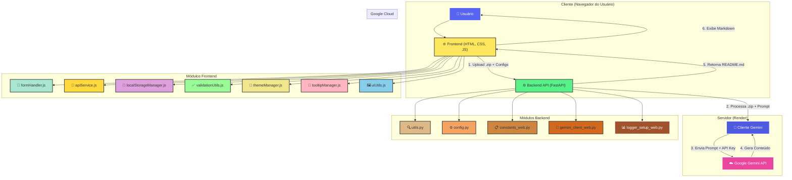

# Readme Generation - Geração Inteligente de READMEs com IA

**Slogan Filosófico:**  
_Automatizando a Documentação de Projetos com Inteligência Artificial para Potencializar a Colaboração e o Entendimento._

---

## Abstract (Resumo Técnico)

O projeto **Readme Generation** é uma aplicação web inovadora projetada para simplificar e aprimorar drasticamente o processo de criação de arquivos README.md para projetos de software. No contexto atual de desenvolvimento ágil e colaborativo, uma documentação clara, concisa e abrangente é crucial, porém frequentemente negligenciada devido ao tempo e esforço exigidos. Este projeto aborda essa lacuna ao empregar a capacidade de modelos de linguagem de grande escala (LLMs), especificamente a API Gemini do Google, para analisar a estrutura e o conteúdo de um projeto de software (fornecido como arquivo `.zip`) e gerar automaticamente um README.md estruturado e completo.

A solução consiste em uma interface frontend intuitiva construída com HTML5, CSS3 moderno e JavaScript modular, onde o usuário pode fazer upload do seu projeto, fornecer sua chave de API do Gemini, selecionar o modelo desejado e o nível de detalhamento. O backend, desenvolvido com FastAPI (Python), processa esses inputs, extrai dados relevantes do projeto, constrói prompts otimizados e interage com a API Gemini para gerar conteúdo de alta qualidade. A principal contribuição deste projeto reside na automação inteligente da documentação, visando economizar tempo dos desenvolvedores, padronizar a qualidade dos READMEs e facilitar a integração e compreensão de novos projetos.

---

## ✨ Badges Abrangentes

  
  
  
  
  
  
  
  


---

## 📜 Sumário (Table of Contents)

- [Abstract (Resumo Técnico)](#abstract-resumo-técnico)  
- [✨ Badges Abrangentes](#-badges-abrangentes)  
- [📖 Introdução e Motivação](#-introdução-e-motivação)  
- [🔗 Link Principal / Acesso ao Projeto](#-link-principal--acesso-ao-projeto)  
- [🖼️ Demonstração Visual](#️-demonstração-visual)  
- [🏗️ Arquitetura do Sistema](#️-arquitetura-do-sistema)  
- [💡 Decisões de Design Chave](#-decisões-de-design-chave)  
- [✨ Funcionalidades Detalhadas (com Casos de Uso)](#-funcionalidades-detalhadas-com-casos-de-uso)  
- [🛠️ Tech Stack Detalhado](#️-tech-stack-detalhado)  
- [📂 Estrutura Detalhada do Código-Fonte](#-estrutura-detalhada-do-código-fonte)  
- [📋 Pré-requisitos Avançados](#-pré-requisitos-avançados)  
- [🚀 Guia de Instalação e Configuração Avançada](#-guia-de-instalação-e-configuração-avançada)  
- [⚙️ Uso Avançado e Exemplos](#️-uso-avançado-e-exemplos)  
- [🔧 API Reference](#-api-reference)  
- [🧪 Estratégia de Testes e Qualidade de Código](#-estratégia-de-testes-e-qualidade-de-código)  
- [🚢 Deployment Detalhado e Escalabilidade](#-deployment-detalhado-e-escalabilidade)   
- [📜 Licença e Aspectos Legais](#-licença-e-aspectos-legais)  
- [👥 Equipe Principal e Colaboradores Chave](#-equipe-principal-e-colaboradores-chave)  
- [❓ FAQ (Perguntas Frequentes)](#-faq-perguntas-frequentes)  
- [📞 Contato e Suporte](#-contato-e-suporte)

---

## 📖 Introdução e Motivação

A documentação de software, em particular o arquivo `README.md`, serve como o cartão de visitas de qualquer projeto. É frequentemente o primeiro ponto de contato para desenvolvedores, usuários e potenciais contribuidores. Um README bem elaborado pode significativamente reduzir a barreira de entrada, facilitar a compreensão do propósito do projeto, sua configuração e uso. No entanto, a criação e manutenção de documentação de alta qualidade é uma tarefa que consome tempo e, em muitos ciclos de desenvolvimento rápidos, acaba sendo postergada ou realizada de forma superficial.

O projeto **Readme Generation** surge como uma resposta inovadora a este desafio. A motivação central é alavancar os recentes avanços em Inteligência Artificial, especificamente modelos de linguagem de grande escala (LLMs) como o Gemini do Google, para automatizar a criação de READMEs. A proposta de valor única reside na capacidade da IA de "compreender" o contexto de um projeto através da análise de sua estrutura de diretórios e do conteúdo de arquivos selecionados.

### Problemas Abordados

- **Falta de Tempo:** Desenvolvedores frequentemente priorizam código sobre documentação.  
- **Inconsistência:** READMEs variam drasticamente em qualidade e estrutura.  
- **Curva de Aprendizado:** Novos projetos sem documentação adequada são difíceis de entender.  
- **Manutenção:** Documentação desatualizada prejudica a colaboração.

### Nossa Solução

A ferramenta gera um README.md inicial significativamente mais completo e relevante do que um template vazio, economizando tempo para os desenvolvedores e elevando o padrão da documentação de software.

---

## 🔗 Link Principal / Acesso ao Projeto

Experimente a aplicação agora mesmo e transforme a documentação dos seus projetos:

[🚀 Acessar o Readme Generation (Aplicação Online)](https://readme-generate-2.onrender.com)

A plataforma está hospedada no Render e permite que você utilize todas as funcionalidades do projeto diretamente no seu navegador, sem necessidade de instalação local.

---

## 🖼️ Demonstração Visual

### Interface Principal da Aplicação

<div align="center">


</div>

*Captura de tela mostrando a interface principal com as seções de configuração essencial, detalhes do README e upload do projeto.*

**Principais Características Visuais:**

- Design Dark/Light Mode: Interface adaptável com tema claro e escuro  
- Layout Responsivo: Otimizado para desktop e mobile  
- Feedback Visual: Indicadores de progresso e validação em tempo real  
- UI/UX Moderna: Inspirada no Discord com cores e elementos visuais contemporâneos  

---

## 🏗️ Arquitetura do Sistema

A aplicação é estruturada em uma arquitetura de cliente-servidor desacoplada, otimizada para implantação em plataformas serverless e focada em escalabilidade e manutenibilidade.



**Componentes Principais:**

1. **Frontend (Cliente):** Single-Page Application (SPA) construída com HTML5, CSS3 moderno (incluindo Tailwind CSS) e JavaScript ES6+ modular. Responsável pela interação com o usuário, validação de formulários, comunicação com o backend e renderização dos resultados.

2. **Backend (Servidor FastAPI):** API RESTful desenvolvida em Python com FastAPI, executada como função serverless no Render. Suas responsabilidades incluem processamento de arquivos `.zip`, construção de prompts otimizados, rate limiting e comunicação segura com a API Gemini.

3. **Google Gemini API:** O núcleo de inteligência artificial que analisa o contexto do projeto e gera o conteúdo do README.md em Markdown formatado.

**Fluxo de Dados Típico:**

1. Usuário configura API Key, seleciona modelo Gemini e faz upload do projeto
2. Frontend valida dados e envia requisição para o backend
3. Backend extrai estrutura e conteúdo relevante do `.zip`
4. Sistema constrói prompt personalizado baseado no nível de detalhe escolhido
5. Backend comunica-se com a API Gemini usando a chave do usuário
6. Gemini processa e retorna o README gerado
7. Frontend exibe o resultado com opções de cópia e download

---

## 💡 Decisões de Design Chave

### 1. FastAPI para o Backend

* **Justificativa:** Alta performance, suporte nativo a operações assíncronas, validação automática com Pydantic, documentação auto-gerada (Swagger UI)
* **Trade-offs:** Curva de aprendizado inicial, mas benefícios superam a complexidade

### 2. Frontend com Vanilla JavaScript Modular

* **Justificativa:** Mantém a aplicação leve, carregamento rápido, sem necessidade de build complexo
* **Arquitetura:** Uso de ES6 modules para organização escalável do código
* **Trade-offs:** Menos abstrações que frameworks como React, mas maior controle e performance

### 3. Chave de API do Lado do Cliente

* **Justificativa:** Transfere custos e limites de uso da API para o usuário final, tornando o serviço sustentável e gratuito
* **Segurança:** API Key é enviada diretamente do navegador para nosso backend e depois para o Gemini, não sendo armazenada em nossos servidores
* **Trade-offs:** Responsabilidade do usuário manter sua chave segura

### 4. Arquitetura Serverless (Render)

* **Justificativa:** Escalabilidade automática, CI/CD simplificado, modelo de custo eficiente (pay-for-use)
* **Benefícios:** Deploy automático via Git, sem gerenciamento de infraestrutura
* **Trade-offs:** Cold starts ocasionais, limitações de execução

### 5. Prompts Estruturados e Hierárquicos

* **Justificativa:** Em vez de prompts simples, construímos prompts complexos e detalhados com diferentes níveis (Simples, Moderado, Completo)
* **Implementação:** Templates em `constants_web.py` com instruções específicas para cada nível
* **Resultado:** READMEs de alta qualidade e bem formatados

### 6. Tema Dark/Light e Design System Moderno

* **Justificativa:** UX contemporânea inspirada no Discord, acessibilidade, preferências do usuário
* **Implementação:** CSS customizado com variáveis CSS para troca dinâmica de temas
* **Benefícios:** Interface profissional e agradável de usar

---

## ✨ Funcionalidades Detalhadas (com Casos de Uso)

### 1. Geração de README em Três Níveis de Detalhe

* **Simples:** README conciso com informações essenciais (instalação, uso básico)
* **Moderado:** Documentação profissional balanceada com seções principais
* **Completo:** README exaustivo com estrutura acadêmica e detalhamento técnico avançado

**Caso de Uso:** Um desenvolvedor iniciante escolhe "Simples" para um projeto pessoal, enquanto uma empresa opta por "Completo" para um projeto open-source corporativo.

### 2. Seleção Dinâmica de Modelos Gemini

* **Funcionalidade:** Após inserir API Key válida, a aplicação lista automaticamente os modelos Gemini disponíveis
* **Modelos Suportados:** Gemini 2.0 Flash (recomendado), Gemini 2.5 Pro Preview, entre outros
* **Inteligência:** Recomendações contextuais baseadas no tipo de projeto

**Caso de Uso:** Usuário com acesso a modelos premium pode escolher Gemini Pro para análise de projetos complexos, enquanto outros usam Flash para velocidade e economia.

### 3. Contextualização Inteligente com Links

* **Repositório:** Infere usuário/projeto do GitHub para badges dinâmicos e comandos git corretos
* **Projeto Live:** Cria seções de demonstração e links diretos para aplicações em produção
* **LinkedIn:** Enriquece seção de autores com perfis profissionais

**Caso de Uso:** Ao fornecer `https://github.com/usuario/projeto`, a IA automaticamente gera badges e comandos git correspondentes.

### 4. Sistema de Badges Personalizáveis

* **Tipos Disponíveis:** Licença, Issues Abertas, Pull Requests, Último Commit, Linguagem Principal, Tamanho do Código, Contribuidores
* **Personalização:** Usuário seleciona quais badges incluir
* **Estilo:** Todos os badges usam `style=for-the-badge` para visual moderno

**Caso de Uso:** Projeto open-source seleciona badges de Issues e Pull Requests para incentivar contribuições, enquanto projeto pessoal foca apenas em Licença e Linguagem Principal.

### 5. Persistência Local de Configurações

* **Armazenamento:** localStorage do navegador para API Key, modelo selecionado, URLs e preferências
* **Conveniência:** Usuários frequentes não precisam reinserir configurações
* **Privacidade:** Dados permanecem apenas no navegador do usuário

**Caso de Uso:** Desenvolvedor que usa a ferramenta regularmente tem suas configurações salvas automaticamente, agilizando o processo.

### 6. Interface Responsiva com Tema Duplo

* **Design System:** Inspirado no Discord com paleta de cores moderna
* **Responsividade:** Layout adaptativo para desktop, tablet e mobile
* **Temas:** Dark e Light mode com transições suaves
* **Acessibilidade:** Contraste adequado, navegação por teclado, tooltips informativos

**Caso de Uso:** Usuário trabalhando à noite prefere dark mode, enquanto durante o dia utiliza light mode, com a preferência sendo lembrada automaticamente.

### 7. Sistema de Tooltips Educativos

* **Guidance:** Explicações detalhadas para cada campo e conceito
* **Onboarding:** Novos usuários compreendem facilmente como usar a ferramenta
* **Design:** Tooltips elegantes com informações contextuais

**Caso de Uso:** Usuário iniciante em APIs de IA pode clicar


no tooltip sobre "API Key do Gemini" para entender o que é e como obter uma.

### 8. Validação Inteligente e Feedback em Tempo Real

* **Validação de API Key:** Formato, comprimento e autenticidade
* **URLs:** Validação de domínios específicos (GitHub, LinkedIn) com feedback imediato
* **Estados do Botão:** Ativação/desativação baseada na validade de todos os campos
* **Mensagens Contextuais:** Orientações específicas para cada tipo de erro

**Caso de Uso:** Ao digitar uma API Key inválida, o usuário recebe feedback imediato sobre o formato esperado antes mesmo de tentar gerar o README.

---

## 🛠️ Tech Stack Detalhado

| Categoria           | Tecnologia          | Versão   | Propósito no Projeto                        | Justificativa da Escolha                                           |
| ------------------- | ------------------- | -------- | ------------------------------------------- | ------------------------------------------------------------------ |
| **Backend**         | Python              | 3.9+     | Linguagem principal para lógica do servidor | Ecossistema rico para IA, sintaxe clara, SDK oficial               |
|                     | FastAPI             | 0.100+   | Framework para API RESTful                  | Alta performance, async nativo, validação automática, docs Swagger |
|                     | Uvicorn/Gunicorn    | >=0.20.0 | Servidores ASGI para produção               | Padrão para servir aplicações FastAPI                              |
|                     | python-multipart    | >=0.0.5  | Processamento de upload de arquivos         | Receber arquivos .zip via FormData                                 |
| **Frontend**        | HTML5               | N/A      | Estrutura semântica da aplicação            | Padrão web universal, suporte a APIs modernas                      |
|                     | CSS3 + Variáveis    | N/A      | Estilização avançada e sistema de temas     | Dark/light mode, animações, responsividade                         |
|                     | Tailwind CSS        | v3       | Framework CSS utilitário via CDN            | Desenvolvimento rápido, classes utilitárias                        |
|                     | JavaScript ES6+     | N/A      | Lógica cliente, interatividade, módulos     | Linguagem nativa do navegador, modularização                       |
|                     | Ionicons            | 7.1.0    | Biblioteca de ícones moderna                | Ícones vetoriais leves, consistência visual                        |
|                     | Marked.js           | N/A      | Renderização de Markdown no frontend        | Parser rápido e confiável                                          |
| **IA**              | Google Gemini API   | N/A      | Geração de conteúdo inteligente             | Modelos versáteis, API bem documentada                             |
|                     | google-generativeai | >=0.5.0  | SDK Python para Gemini                      | Cliente oficial com suporte completo                               |
| **DevOps**          | Render              | N/A      | Plataforma de nuvem para deploy             | CI/CD automático, escalabilidade, integração Git                   |
|                     | python-dotenv       | >=1.0.0  | Gerenciamento de variáveis de ambiente      | Configuração flexível entre ambientes                              |
| **Desenvolvimento** | Git & GitHub        | N/A      | Controle de versão e colaboração            | Padrão da indústria, integração com Render                         |

---

## 📂 Estrutura Detalhada do Código-Fonte

```
readme-generate-2-main/
├── api/
│   └── index.py                    # Endpoint principal FastAPI, lógica serverless
├── gerador_readme_ia_web/          # Módulo backend Python
│   ├── __init__.py                 # Inicializador do pacote
│   ├── config.py                   # Configurações do sistema
│   ├── constants_web.py            # Templates de prompts para IA
│   ├── gemini_client_web.py        # Cliente Gemini encapsulado
│   ├── logger_setup_web.py         # Sistema de logging detalhado
│   └── utils.py                    # Extração e processamento de .zip
├── public/                         # Assets estáticos frontend
│   ├── assets/                     # Imagens, ícones, favicons
│   ├── js/                        # Módulos JS organizados
│   │   ├── apiService.js           # Comunicação backend
│   │   ├── formHandler.js          # Validação e envio de formulário
│   │   ├── localStorageManager.js  # Persistência local
│   │   ├── script.js               # Ponto de entrada JS
│   │   ├── themeManager.js         # Dark/light mode
│   │   ├── tooltipManager.js       # Tooltips interativos
│   │   ├── uiUtils.js              # Utilitários UI
│   │   └── validationUtils.js      # Validação campos e feedback
│   └── style.css                   # Estilo CSS principal
├── index.html                      # SPA principal
├── requirements.txt                # Dependências Python
├── LICENSE.md                     # Licença MIT
└── README.md                      # Este arquivo de documentação
```

---

## 📋 Pré-requisitos Avançados

### Para Uso da Aplicação

* Navegador moderno: Chrome 80+, Firefox 75+, Safari 13+, Edge 80+
* JavaScript habilitado para SPA funcionar
* Conexão com internet para API e assets
* Chave API Google Gemini:

  * Obtenha em: [Google AI Studio](https://aistudio.google.com/app/apikey)
  * Formato: `AIzaSy...` (39 caracteres)

### Para Desenvolvimento Local

* Python 3.9+
* pip (gerenciador de pacotes Python)
* Git para controle de versão
* Editor de código (VS Code, PyCharm, etc.)

### Dependências de Sistema (Opcional)

* Node.js (para builds avançados)
* Docker (para containerização local)

### Verificações de Ambiente

```bash
python --version  # >= 3.9
pip --version     # >= 21.0
git --version     # >= 2.25
```

---

## 🚀 Guia de Instalação e Configuração Avançada

### 1. Clonar Repositório

```bash
git clone https://github.com/ESousa97/readme-generate-2.git
cd readme-generate-2
```

### 2. Criar e Ativar Ambiente Virtual

```bash
python -m venv venv

# Linux/Mac
source venv/bin/activate

# Windows
venv\Scripts\activate
```

### 3. Instalar Dependências

```bash
pip install -r requirements.txt
```

### 4. Configurar Variáveis de Ambiente (Opcional)

Crie `.env` na raiz:

```env
APP_NAME=GeradorREADMEWeb
PYTHON_ENV=development
GEMINI_MODEL_NAME=gemini-2.0-flash-latest
```

### 5. Executar Servidor Localmente

```bash
uvicorn api.index:app --reload --host 127.0.0.1 --port 8000
```

---

## ⚙️ Uso Avançado e Exemplos

### Fluxo Básico

1. Comprimir projeto em `.zip` (excluir `node_modules`, `.git`, `venv`)
2. Inserir API Key Gemini na interface
3. Selecionar modelo e nível de detalhe
4. Fazer upload do `.zip`
5. Gerar README
6. Visualizar, copiar ou baixar resultado

### Exemplo de Configuração JSON

```json
{
  "apiKey": "AIzaSyBxxxxxxxxxxxxxxxxxxxxxxxxxxxxxx",
  "modelo": "gemini-2.0-flash-latest",
  "nivel": "complete",
  "repositorio": "https://github.com/usuario/projeto",
  "projeto": "https://projeto.vercel.app",
  "linkedin": "https://linkedin.com/in/usuario",
  "badges": ["License", "Issues", "Last Commit", "Top Language"]
}
```

### Exemplos de Estruturas de Projeto Ideais

```
projeto-exemplo/
├── src/
│   ├── main.py
│   ├── config.py
│   └── utils/
├── tests/
│   └── test_main.py
├── docs/
├── requirements.txt
├── package.json
├── Dockerfile
├── .env.example
├── LICENSE
└── .gitignore
```

---

## 🔧 API Reference

### Base URL

* Produção: `https://readme-generate-2.onrender.com/api`
* Desenvolvimento: `http://127.0.0.1:8000/api`

### Autenticação

Incluir header:

```
X-API-Key: SUA_CHAVE_GEMINI_AQUI
```

### Endpoints Principais

#### GET /list-models

* Lista modelos Gemini disponíveis para a API Key.

Headers:

```
X-API-Key: AIzaSy... (obrigatório)
```

Resposta exemplo:

```json
{
  "models": [
    {
      "id": "gemini-2.0-flash-latest",
      "name": "Gemini 2.0 Flash",
      "full_name": "models/gemini-2.0-flash-latest"
    }
  ]
}
```

#### POST /generate-readme

* Gera README.md baseado no projeto e configurações enviadas.

Headers:

```
X-API-Key: AIzaSy...
Content-Type: multipart/form-data
```

Body (FormData):

* `project_zip` (file) - arquivo zip do projeto (obrigatório)
* `readme_level` (string) - nível de detalhamento (`simple`, `moderate`, `complete`) (obrigatório)
* `repo_link`, `project_link`, `linkedin_link` (string) - URLs opcionais
* `requested_badges` (string) - badges separados por vírgula (opcional)
* `gemini_model_select` (string) - modelo Gemini específico (opcional)

Resposta:

```json
{
  "readme_content": "# Título do Projeto\n\nConteúdo gerado...",
  "filename": "projeto_README.md"
}
```

### Códigos de Status e Rate Limiting

* 200 OK: Sucesso
* 400 Bad Request: Dados inválidos ou prompt bloqueado
* 401 Unauthorized: API Key inválida
* 429 Too Many Requests: Limite excedido
* 500 Internal Server Error: Erro interno

Rate Limit: 5 requisições por minuto por IP com bloqueios progressivos.

---

## 🧪 Estratégia de Testes e Qualidade de Código

### Backend

* Testes unitários: utils, cliente Gemini, validação, geração de prompts
* Testes de integração: endpoints API e integração real com Gemini
* Testes end-to-end (E2E): fluxo completo

### Frontend

* Testes unitários: validação, persistência, comunicação API
* Testes de integração: integração dos módulos do formulário
* E2E: simulação fluxo usuário

### Ferramentas

* Backend: pytest, pytest-asyncio, httpx, pytest-mock
* Frontend: Jest, Testing Library, Cypress, Mock Service Worker

### Integração Contínua (CI)

Configuração GitHub Actions para testes automatizados em pushes e pull requests.

---

## 🚢 Deployment Detalhado e Escalabilidade

### Atual

* Deploy em Render Web Service
* Python 3.9+, gunicorn + uvicorn workers
* Auto-scale de 1 a 10 instâncias
* Health checks e logs centralizados

### Alternativas

* Vercel (frontend + edge functions)
* Railway
* Google Cloud Run (Docker)

### Monitoramento

* Métricas de sistema (requests, erros, uso de recursos)
* Health checks customizados
* Alertas proativos por email/Slack/SMS

### Backup & Disaster Recovery

* Backup Git (GitHub e GitLab mirror)
* Backup configurações Render
* Planos para failover multi-cloud

---

## 📜 Licença e Aspectos Legais

* Licença: **MIT License** (uso comercial, modificação, distribuição permitidos)
* Responsabilidade e garantia limitadas
* Dependências compatíveis (FastAPI, Google Generative AI, Tailwind, etc.)
* Política de uso da API Gemini: chave sob responsabilidade do usuário

---

## 👥 Equipe Principal e Colaboradores Chave

### Enoque Sousa

* Desenvolvedor Full-Stack e Arquiteto
* GitHub: [@ESousa97](https://github.com/ESousa97)
* LinkedIn: [Enoque Sousa](https://www.linkedin.com/in/enoque-sousa-bb89aa168/)

---

## ❓ FAQ (Perguntas Frequentes)

### Segurança e Privacidade

* **Minha API Key está segura?** Nunca armazenamos sua chave, ela fica apenas no navegador e é transmitida diretamente.
* **Arquivos .zip são armazenados?** Não, são processados temporariamente e descartados.
* **Uso comercial permitido?** Sim, sob licença MIT, respeitando termos da API Gemini.

### Funcionalidades e Uso

* **Por que "Prompt bloqueado"?** Filtros de segurança da API, revise arquivos sensíveis.
* **Níveis Simples, Moderado, Completo?** Diferentes graus de detalhamento e complexidade.
* **Posso editar o README gerado?** Sim, livremente após geração.
* **Quais projetos funcionam melhor?** Projetos organizados, com arquivos de configuração e comentários.

### Custos e Limites

* **Serviço gratuito?** Sim, mas uso da API Gemini pode ter custos.
* **Limites de geração?** Rate limit de 5 requisições/minuto por IP.
* **Erro 429?** Limite do serviço ou da API Gemini.

### Técnicos

* **Botão "Gerar" desabilitado?** Campos obrigatórios inválidos ou incompletos.
* **Como obter API Key?** Em [Google AI Studio](https://aistudio.google.com/app/apikey).
* **Projetos grandes?** Limites de tamanho aplicados (máx 5MB .zip, até 70 arquivos analisados).

---

## 📞 Contato e Suporte

### Suporte e Reporte de Problemas

* **Issues GitHub:** [Abrir Issue](https://github.com/ESousa97/readme-generate-2/issues)
* **Discussions:** [Participar](https://github.com/ESousa97/readme-generate-2/discussions)
* **Pull Requests:** [Enviar contribuição](https://github.com/ESousa97/readme-generate-2/pulls)

### Contato Direto

* **Enoque Sousa**

  * GitHub: [@ESousa97](https://github.com/ESousa97)
  * LinkedIn: [Enoque Sousa](https://www.linkedin.com/in/enoque-sousa-bb89aa168/)

---

<p align="center">
  <sub>Desenvolvido com ❤️ por <a href="https://github.com/ESousa97">Enoque Sousa</a></sub>
</p>

<p align="center">
  <sub>© 2025 Readme Generation. Distribuído sob a <a href="/LICENSE.md">Licença MIT</a>.</sub>
</p>

---

> ✨ **Criado em:** 19 de mai. de 2025 às 20:33
