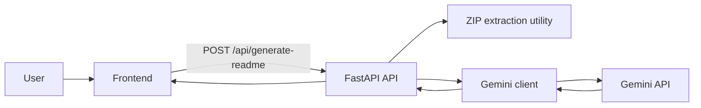

# Architecture

## Overview

The application is a two-layer system:

- FastAPI backend in `api/index.py` for model listing and README generation
- Static modular frontend in `index.html` + `public/js/*`

## Backend responsibilities

- Request validation and orchestration
- Rate limiting by IP
- Prompt assembly with user-provided links and selected detail level
- Delegation to Gemini API client
- Standardized error payloads and security response headers

## Frontend responsibilities

- Collect and validate user input
- Persist non-sensitive preferences in localStorage
- Submit ZIP and metadata to backend
- Render and expose generated Markdown output

## Request flow

## Security model

- API key is provided by user per request via `X-API-Key`
- Backend does not persist API key
- CORS is environment-controlled via `CORS_ALLOWED_ORIGINS`
- Security headers are appended on every response
